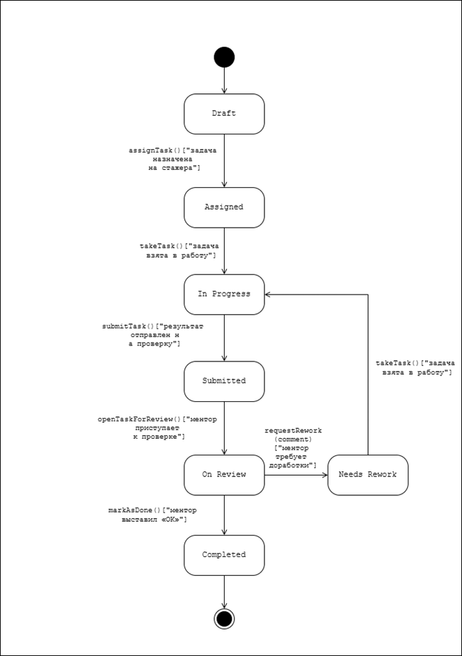
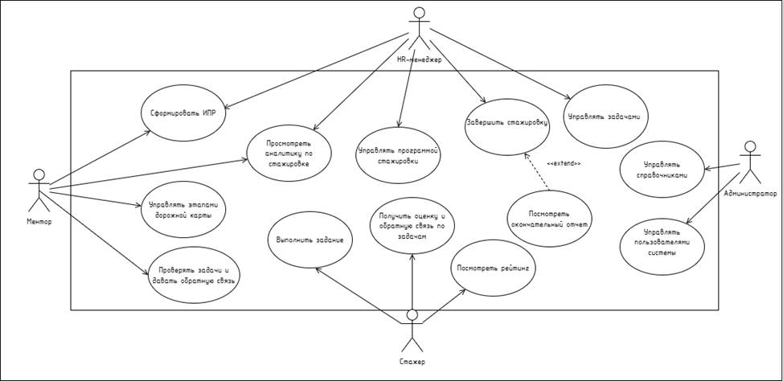
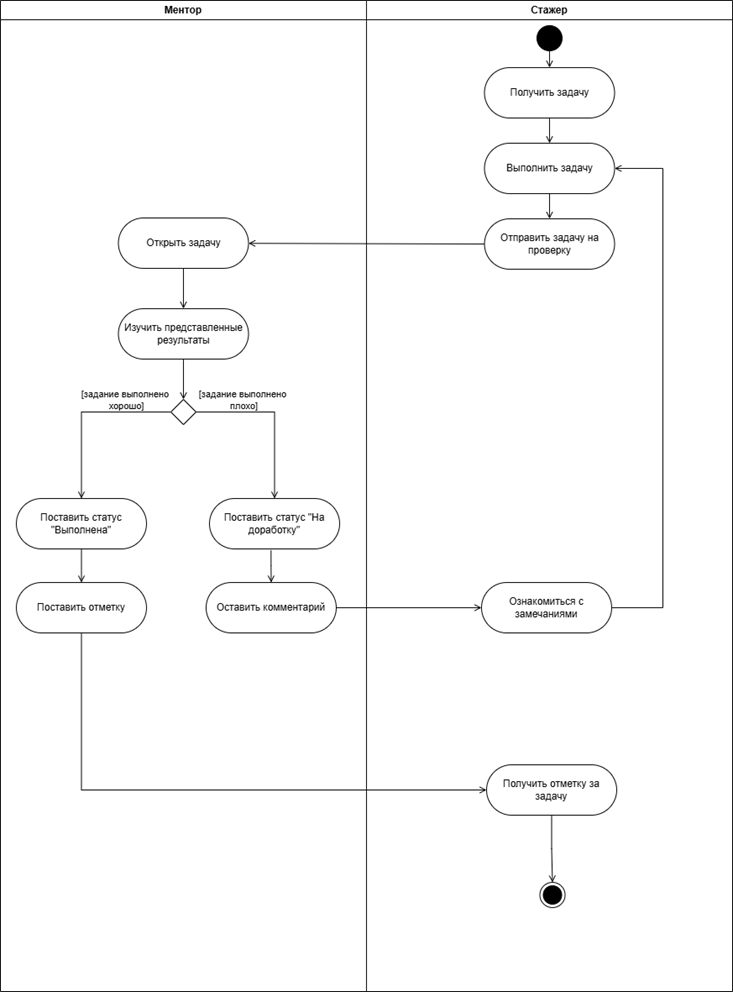
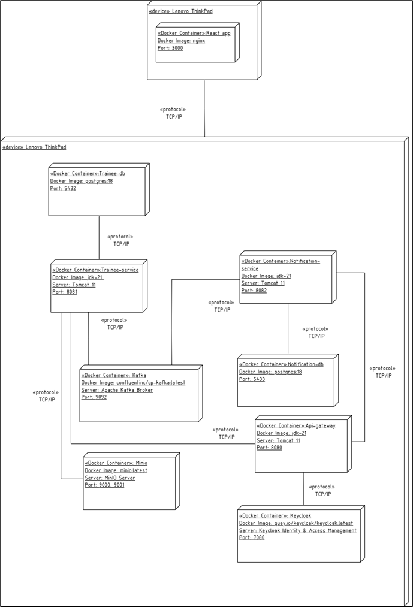
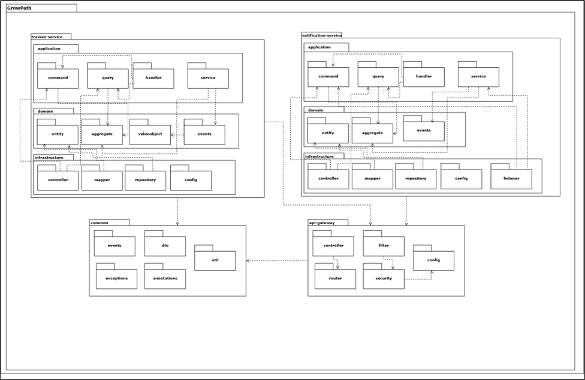

# **Программное средство управления процессом стажировки сотрудников**

Программное средство управления процессом стажировки сотрудников объединяет HR, менторов и стажёров в единый цикл — от набора и онбординга новых стажеров до обучения, оценки прогресса стажеров и принятия решения о приеме в штаб компании. Программное средство позволяет формировать программы стажировок с целями и компетенциями, назначать роли, планировать дорожную карту развития каждого стажера, назначать ассессменты, вести трекинг задач и давать структурированную обратную связь и рекомендации по дальнейшему развитию. Ведение рейтинга стажеров и отчётность обеспечивают легкость в отслеживании прогресса и позволяют принимать решения о найме на основе статистических данных.


**Ссылки на репозитории сервера и клиента**:  
сервер - https://github.com/pashpashovich/GrowPathServer  
клиент - https://github.com/pashpashovich/GrowPathClient

**Цель программного средства**: упростить процесс организации стажировок для компаний и улучшить процесс прохождения стажировок для сотрудников.

---

## **Содержание**

1. [Архитектура](#Архитектура)
	1. [C4-модель](#C4-модель)
	2. [Схема данных](#схема-данных)
2. [Функциональные возможности](#функциональные-возможности)
	1. [Диаграмма вариантов использования](#диаграмма-вариантов-использования)
	2. [User-flow диаграммы](#user-flow-диаграммы)
3. [Пользовательский интерфейс](#пользовательский-интерфейс)
    1. [Примеры экранов UI](#примеры-экранов-ui)
4. [Детали реализации](#детали-реализации)
	1. [UML-диаграммы](#UML-диаграммы)
	2. [Спецификация API](#спецификация-api)
	3. [Безопасность](#Безопасность)
	4. [Оценка качества кода](#оценка-качества-кода)
5. [Тестирование](#Тестирование)
	1. [Unit-тесты](#модульное-unit-тестирование)
	2. [Интеграционные тесты](#интеграционное-тестирование)
6. [Установка и запуск](#установка-и-запуск)
7. [Лицензия](#Лицензия)
8. [Контакты](#Контакты)

---
## **Архитектура**

### C4-модель

**Контекстный уровень представления архитектуры**


**Контейнерный уровень представления архитектуры**


**Компонентный уровень представления архитектуры**


**Кодовый уровень представления архитектуры**


### Схема данных

**Физическая схема БД interhship**


**Физическая схема БД notification**


---

## **Функциональные возможности**

### Диаграмма вариантов использования

Диаграмма вариантов использования и ее описание

### User-flow диаграммы

**User-flow диаграмма стажера**


**User-flow диаграмма ментора**


**User-flow диаграмма HR-менеджера**


**User-flow диаграмма администратора**


---

## **Пользовательский интерфейс**

### Примеры экранов UI

Ссылка на репозиторий клиента: https://github.com/pashpashovich/GrowPathClient

#### Форма авторизации:


#### Канбан-доска задач ментора:


#### Экран с деталями задачи:


#### Экран создания задачи:


#### Экран дорожной карты стажеров:


#### Экран проверки заданий:


#### Экран управления программами стажировки:


#### Экран создания программы стажировки:


#### Экран с деталями программы стажировки:


#### Экран аналитики программ стажировок:


#### Экран загрузки менторов:


#### Экран задач стажера:


#### Экран с деталями задачи (в модуле стажера):


#### Экран прогресса стажера:


#### Экран управления пользователями:


#### Экран добавления пользователя:


---

## **Детали реализации**

### UML-диаграммы

#### Диаграмма состояний объекта "Задача"



#### Диаграмма вариантов использования



#### Диаграмма деятельности процесса "Проверять задание"



#### Диаграмма размещения



#### Диаграмма пакетов



### Спецификация API

В рамках разработки для проектирования взаимодействия между клиентом и сервером выбран подход **API-First**. В отличие от генерации документации из кода, данный подход подразумевает первоначальное создание спецификации API, которая выступает в роли строгого контракта.

#### Подход API-First

Разработка велась в следующей последовательности:

1. **Проектирование спецификации** - Спроектирован файл спецификации в формате YAML по стандарту OpenAPI 3.0. В нем описаны все эндпоинты, типы данных, обязательные поля и коды ответов.

2. **Генерация кода** - С использованием инструмента `openapi-generator` на основе спецификации автоматически сгенерированы Java-интерфейсы контроллеров и DTO-классы (Data Transfer Objects). Это гарантирует полное соответствие реализации заявленному интерфейсу.

3. **Реализация логики** - Серверная часть реализована путем наследования и имплементации сгенерированных интерфейсов, что исключает ошибки в именовании путей или типов данных.

#### Доступ к документации API

Для визуализации и тестирования используется **Swagger UI**. Интерфейс доступен по следующим адресам:

- **Trainee Service:** http://localhost:8081/swagger-ui/index.html
- **Notification Service:** http://localhost:8082/swagger-ui/index.html
- **API Gateway:** http://localhost:8080/swagger-ui.html

Так как спецификация является первоисточником, документация в Swagger UI всегда актуальна.

#### Импорт в Postman

Для проведения интеграционного тестирования предусмотрены готовые коллекции Postman, которые можно импортировать напрямую. Коллекции содержат все эндпоинты API с предзаполненными параметрами, что исключает ручной ввод URL и заголовков.

**Готовые коллекции Postman:**

В папке `postman` находятся готовые коллекции для импорта:

- [GrowPath API.postman_collection.json](postman/GrowPath%20API.postman_collection.json) - основная коллекция API для работы с программами стажировок, стажерами, задачами и другими сущностями
- [Notification Service API.postman_collection.json](postman/Notification%20Service%20API.postman_collection.json) - коллекция API для работы с уведомлениями

**Инструкция по импорту готовых коллекций:**

1. Откройте Postman
2. Нажмите **Import** в левом верхнем углу
3. Выберите вкладку **File** или **Link**
4. Для импорта через файл:
    - Выберите один из файлов коллекций из папки `postman`:
        - `postman/GrowPath API.postman_collection.json`
        - `postman/Notification Service API.postman_collection.json`
5. Для импорта через URL (если файлы размещены в репозитории):
    - Используйте прямую ссылку на файл коллекции из репозитория
6. Нажмите **Continue** и затем **Import**

После импорта в Postman будет создана коллекция запросов со всеми эндпоинтами API.

**Альтернативный способ - импорт из OpenAPI спецификации:**

Также можно импортировать коллекции из YAML-файлов спецификации OpenAPI:

1. Откройте Postman
2. Нажмите **Import** в левом верхнем углу
3. Выберите вкладку **File** или **Link**
4. Для импорта через файл:
    - Используйте файлы спецификации из проекта:
        - `trainee-service/src/main/resources/api/trainee-api.yaml`
        - `notification-service/src/main/resources/api/notification-api.yaml`
        - `api-gateway/src/main/resources/api/auth-api.yaml`
5. Для импорта через URL:
    - Вставьте один из следующих URL:
        - Trainee Service: `http://localhost:8081/v3/api-docs`
        - Notification Service: `http://localhost:8082/v3/api-docs`
        - API Gateway: `http://localhost:8080/v3/api-docs`
6. Нажмите **Continue** и затем **Import**

#### Файлы спецификации

Исходные файлы OpenAPI спецификации находятся в проекте:
- `api-gateway/src/main/resources/api/auth-api.yaml`
- `trainee-service/src/main/resources/api/trainee-api.yaml`
- `notification-service/src/main/resources/api/notification-api.yaml`

### Безопасность

#### Система аутентификации и авторизации

##### Обзор

В системе реализована комплексная система аутентификации и авторизации на основе OAuth2/OpenID Connect с использованием Keycloak в качестве Identity Provider. Все запросы проходят через API Gateway, который обеспечивает централизованную аутентификацию и авторизацию.

##### Используемые компоненты

###### 1. Keycloak
**Keycloak** - это open-source решение для управления идентификацией и доступом (IAM), которое обеспечивает:
- Централизованную аутентификацию пользователей
- Управление ролями и правами доступа
- Поддержку протоколов OAuth2 и OpenID Connect
- Выдачу JWT токенов

###### 2. Spring Security OAuth2 Resource Server
Используется для валидации JWT токенов на стороне микросервисов. Автоматически проверяет подпись токенов через JWK Set endpoint Keycloak.

###### 3. Spring Cloud Gateway
Обеспечивает маршрутизацию запросов и обработку аутентификации через кастомные фильтры.

##### Архитектура системы безопасности

```
┌─────────────┐
│   Client    │
│ (Frontend)  │
└──────┬──────┘
       │
       │ HTTP Request
       ▼
┌─────────────────────────────────┐
│       API Gateway               │
│  ┌──────────────────────────┐  │
│  │  CORS Filter             │  │
│  └──────────────────────────┘  │
│  ┌──────────────────────────┐  │
│  │  Security Filter Chain   │  │
│  │  - JWT Validation        │  │
│  │  - Authorization          │  │
│  └──────────────────────────┘  │
│  ┌──────────────────────────┐  │
│  │  Auth Filters            │  │
│  │  - Login                 │  │
│  │  - Logout                │  │
│  │  - Refresh Token         │  │
│  └──────────────────────────┘  │
└──────┬──────────────────────────┘
       │
       ├─────────────────┐
       │                 │
       ▼                 ▼
┌─────────────┐   ┌──────────────┐
│  Keycloak   │   │  Microservices│
│  (IAM)      │   │  - Trainee   │
│             │   │  - Notification│
└─────────────┘   └──────────────┘
```

##### Реализация аутентификации

###### 1. Конфигурация Spring Security

```java
@Configuration
@EnableWebFluxSecurity
public class SecurityConfig {

    @Bean
    public SecurityWebFilterChain securityWebFilterChain(ServerHttpSecurity http) {
        http
                .csrf(ServerHttpSecurity.CsrfSpec::disable)
                .authorizeExchange(exchanges -> exchanges
                        .pathMatchers("/actuator/**", "/health").permitAll()
                        .pathMatchers("/api/auth/login", "/api/auth/logout", "/api/auth/refresh").permitAll()
                        .pathMatchers("/api/auth/user", "/api/auth/validate").authenticated()
                        .anyExchange().authenticated()
                )
                .oauth2ResourceServer(oauth2 -> oauth2.jwt(jwt -> {
                }));

        return http.build();
    }
}
```

###### 2. Сервис аутентификации

```java
@Service
public class AuthService {

    private final WebClient webClient;
    private final String keycloakUrl;
    private final String realm;
    private final String clientId;
    private final String clientSecret;

    public AuthService(
            WebClient.Builder webClientBuilder,
            @Value("${spring.security.oauth2.resourceserver.jwt.issuer-uri}") String issuerUri,
            @Value("${keycloak.client.id:api-gateway}") String clientId,
            @Value("${keycloak.client.secret:api-gateway-secret}") String clientSecret) {
        this.webClient = webClientBuilder.build();

        if (issuerUri.contains("/realms/")) {
            int realmsIndex = issuerUri.indexOf("/realms/");
            this.keycloakUrl = issuerUri.substring(0, realmsIndex);
            this.realm = issuerUri.substring(realmsIndex + "/realms/".length());
        } else {
            this.keycloakUrl = "http://localhost:8090";
            this.realm = "growpath";
        }
        this.clientId = clientId;
        this.clientSecret = clientSecret;
    }

    public Mono<TokenResponse> login(String username, String password) {
        String tokenUrl = String.format("%s/realms/%s/protocol/openid-connect/token", 
                keycloakUrl, realm);

        MultiValueMap<String, String> formData = new LinkedMultiValueMap<>();
        formData.add("grant_type", "password");
        formData.add("client_id", clientId);
        formData.add("client_secret", clientSecret);
        formData.add("username", username);
        formData.add("password", password);

        return webClient.post()
                .uri(tokenUrl)
                .contentType(MediaType.APPLICATION_FORM_URLENCODED)
                .body(BodyInserters.fromFormData(formData))
                .retrieve()
                .bodyToMono(TokenResponse.class)
                .onErrorMap(ex -> new RuntimeException("Failed to authenticate user", ex));
    }

    public Mono<TokenResponse> refreshToken(String refreshToken) {
        String tokenUrl = String.format("%s/realms/%s/protocol/openid-connect/token", 
                keycloakUrl, realm);

        MultiValueMap<String, String> formData = new LinkedMultiValueMap<>();
        formData.add("grant_type", "refresh_token");
        formData.add("client_id", clientId);
        formData.add("client_secret", clientSecret);
        formData.add("refresh_token", refreshToken);

        return webClient.post()
                .uri(tokenUrl)
                .contentType(MediaType.APPLICATION_FORM_URLENCODED)
                .body(BodyInserters.fromFormData(formData))
                .retrieve()
                .bodyToMono(TokenResponse.class)
                .onErrorMap(ex -> new RuntimeException("Failed to refresh token", ex));
    }

    public Mono<Void> logout(String refreshToken) {
        String logoutUrl = String.format("%s/realms/%s/protocol/openid-connect/logout", 
                keycloakUrl, realm);

        MultiValueMap<String, String> formData = new LinkedMultiValueMap<>();
        formData.add("client_id", clientId);
        formData.add("client_secret", clientSecret);
        formData.add("refresh_token", refreshToken);

        return webClient.post()
                .uri(logoutUrl)
                .contentType(MediaType.APPLICATION_FORM_URLENCODED)
                .body(BodyInserters.fromFormData(formData))
                .retrieve()
                .bodyToMono(Void.class)
                .onErrorMap(ex -> new RuntimeException("Failed to logout", ex));
    }

    public String getAuthorizationUrl(String redirectUri) {
        return String.format("%s/realms/%s/protocol/openid-connect/auth?client_id=%s&redirect_uri=%s&response_type=code&scope=openid profile email roles",
                keycloakUrl, realm, clientId, redirectUri);
    }
}
```

###### 3. Gateway Filter для аутентификации

```java
@Slf4j
@Component
public class KeycloakAuthenticationFilter extends AbstractGatewayFilterFactory<KeycloakAuthenticationFilter.Config> {

    private final AuthService authService;
    private final ObjectMapper objectMapper;

    public KeycloakAuthenticationFilter(AuthService authService, ObjectMapper objectMapper) {
        super(Config.class);
        this.authService = authService;
        this.objectMapper = objectMapper;
    }

    @Override
    public String name() {
        return "KeycloakAuthentication";
    }

    @Override
    public GatewayFilter apply(Config config) {
        return (exchange, chain) -> {
            ServerHttpRequest request = exchange.getRequest();

            return DataBufferUtils.join(request.getBody())
                    .flatMap(dataBuffer -> {
                        byte[] bytes = new byte[dataBuffer.readableByteCount()];
                        dataBuffer.read(bytes);
                        DataBufferUtils.release(dataBuffer);

                        String body = new String(bytes, StandardCharsets.UTF_8);

                        try {
                            @SuppressWarnings("unchecked")
                            Map<String, String> loginRequest = objectMapper.readValue(body, Map.class);
                            String username = loginRequest.get("username");
                            String password = loginRequest.get("password");

                            if (!StringUtils.hasText(username) || !StringUtils.hasText(password)) {
                                return handleError(exchange, HttpStatus.BAD_REQUEST,
                                                   "Username and password are required");
                            }

                            return authService.login(username, password)
                                    .flatMap(tokenResponse -> {
                                        ServerHttpResponse response = exchange.getResponse();
                                        response.setStatusCode(HttpStatus.OK);
                                        response.getHeaders().setContentType(MediaType.APPLICATION_JSON);

                                        try {
                                            String json = objectMapper.writeValueAsString(tokenResponse);
                                            DataBuffer buffer = response.bufferFactory()
                                                    .wrap(json.getBytes(StandardCharsets.UTF_8));
                                            return response.writeWith(Mono.just(buffer));
                                        }
                                        catch (JsonProcessingException e) {
                                            return handleError(exchange, HttpStatus.INTERNAL_SERVER_ERROR,
                                                               "Error serializing response");
                                        }
                                    })
                                    .onErrorResume(ex -> {
                                        log.error("Authentication failed", ex);
                                        return handleError(exchange, HttpStatus.UNAUTHORIZED,
                                                           "Authentication failed: " + ex.getMessage());
                                    });
                        }
                        catch (JsonProcessingException e) {
                            log.error("Error parsing login request", e);
                            return handleError(exchange, HttpStatus.BAD_REQUEST, "Invalid request body");
                        }
                    })
                    .switchIfEmpty(handleError(exchange, HttpStatus.BAD_REQUEST, "Request body is required"));
        };
    }

    private Mono<Void> handleError(ServerWebExchange exchange, HttpStatus status, String message) {
        ServerHttpResponse response = exchange.getResponse();
        response.setStatusCode(status);
        response.getHeaders().setContentType(MediaType.APPLICATION_JSON);

        try {
            Map<String, String> errorResponse = Map.of(
                    "error", status.getReasonPhrase(),
                    "message", message
            );
            String json = objectMapper.writeValueAsString(errorResponse);
            DataBuffer buffer = response.bufferFactory().wrap(json.getBytes(StandardCharsets.UTF_8));
            return response.writeWith(Mono.just(buffer));
        }
        catch (JsonProcessingException e) {
            DataBuffer buffer = response.bufferFactory().wrap(message.getBytes(StandardCharsets.UTF_8));
            return response.writeWith(Mono.just(buffer));
        }
    }

    public static class Config {
    }
}
```

##### Реализация авторизации

###### 1. Извлечение ролей из JWT

```java
@NoArgsConstructor(access = AccessLevel.PRIVATE)
public class JwtUtils {

    public static Collection<GrantedAuthority> extractRoles(Jwt jwt) {
        @SuppressWarnings("unchecked")
        var realmAccess = (java.util.Map<String, Object>) jwt.getClaims().get("realm_access");
        if (realmAccess == null) {
            return List.of();
        }

        @SuppressWarnings("unchecked")
        var roles = (List<String>) realmAccess.get("roles");
        if (roles == null) {
            return List.of();
        }

        return roles.stream()
                .map(role -> new SimpleGrantedAuthority("ROLE_" + role))
                .collect(Collectors.toList());
    }

    public static boolean hasRole(Jwt jwt, String role) {
        return extractRoles(jwt).stream()
                .anyMatch(authority -> authority.getAuthority().equals("ROLE_" + role));
    }

    public static String getUsername(Jwt jwt) {
        Object claim = jwt.getClaims().get("preferred_username");
        return claim instanceof String ? (String) claim : null;
    }

    public static String getEmail(Jwt jwt) {
        Object claim = jwt.getClaims().get("email");
        return claim instanceof String ? (String) claim : null;
    }

    public static String getFirstName(Jwt jwt) {
        Object claim = jwt.getClaims().get("given_name");
        return claim instanceof String ? (String) claim : null;
    }

    public static String getLastName(Jwt jwt) {
        Object claim = jwt.getClaims().get("family_name");
        return claim instanceof String ? (String) claim : null;
    }
}
```

###### 2. Получение информации о пользователе

```java
@Component
public class KeycloakUserInfoFilter extends AbstractGatewayFilterFactory<KeycloakUserInfoFilter.Config> {

    @Override
    public GatewayFilter apply(Config config) {
        return (exchange, chain) -> {
            return exchange.getPrincipal()
                    .cast(JwtAuthenticationToken.class)
                    .map(JwtAuthenticationToken::getToken)
                    .flatMap(jwt -> {
                        Map<String, Object> userInfo = new HashMap<>();
                        userInfo.put("username", JwtUtils.getUsername(jwt));
                        userInfo.put("email", JwtUtils.getEmail(jwt));
                        userInfo.put("roles", JwtUtils.extractRoles(jwt).stream()
                                .map(GrantedAuthority::getAuthority)
                                .toList());
                        return response.writeWith(Mono.just(buffer));
                    });
        };
    }
}
```

##### Механизмы обеспечения безопасности

###### 1. CORS (Cross-Origin Resource Sharing)

Настроен для безопасного взаимодействия с фронтенд-приложением:

```java
@Configuration
public class CorsConfig {

    @Value("${cors.allowed-origins:http://localhost:3000,http://localhost:5173}")
    private String allowedOrigins;

    @Value("${cors.allowed-methods:GET,POST,PUT,DELETE,OPTIONS}")
    private String allowedMethods;

    @Value("${cors.allowed-headers:Content-Type,Authorization}")
    private String allowedHeaders;

    @Value("${cors.allow-credentials:true}")
    private boolean allowCredentials;

    @Bean
    public CorsWebFilter corsWebFilter() {
        CorsConfiguration corsConfiguration = new CorsConfiguration();
        
        List<String> origins = Arrays.asList(allowedOrigins.split(","));
        corsConfiguration.setAllowedOrigins(origins);
        
        List<String> methods = Arrays.asList(allowedMethods.split(","));
        corsConfiguration.setAllowedMethods(methods);
        
        List<String> headers = Arrays.asList(allowedHeaders.split(","));
        corsConfiguration.setAllowedHeaders(headers);
        
        corsConfiguration.setAllowCredentials(allowCredentials);
        
        corsConfiguration.setExposedHeaders(Arrays.asList("Authorization", "Content-Type"));
        
        corsConfiguration.setMaxAge(3600L);

        UrlBasedCorsConfigurationSource source = new UrlBasedCorsConfigurationSource();
        source.registerCorsConfiguration("/**", corsConfiguration);

        return new CorsWebFilter(source);
    }
}
```

###### 2. JWT (JSON Web Tokens)

- **Access Token**: используется для доступа к защищенным ресурсам, имеет ограниченное время жизни
- **Refresh Token**: используется для обновления access token без повторной аутентификации
- Валидация токенов происходит автоматически через Spring Security OAuth2 Resource Server

###### 3. Система разграничения прав доступа

Роли пользователей хранятся в Keycloak и передаются в JWT токене:
- Роли извлекаются из токена через `JwtUtils.extractRoles()`
- Преобразуются в `GrantedAuthority` для использования в Spring Security
- Проверка прав доступа осуществляется на уровне Gateway и микросервисов

###### 4. Защита от CSRF

CSRF защита отключена в API Gateway, так как используется stateless аутентификация через JWT токены.

###### 5. Шифрование паролей

Keycloak использует современные алгоритмы хеширования паролей (bcrypt, pbkdf2) по умолчанию. Пароли не хранятся в открытом виде.

###### 6. Безопасность передаваемых данных

- Все запросы к защищенным эндпоинтам требуют наличия валидного JWT токена в заголовке `Authorization: Bearer <token>`
- Токены подписываются с использованием RSA/ECDSA ключей
- Валидация подписи происходит через JWK Set endpoint Keycloak

##### Маршрутизация аутентификации

Аутентификация реализована через Spring Cloud Gateway фильтры:

```yaml
spring:
  cloud:
    gateway:
      routes:
        - id: login
          uri: no://op
          predicates:
            - Path=/api/auth/login
            - Method=POST
          filters:
            - KeycloakAuthentication
        - id: logout
          uri: no://op
          predicates:
            - Path=/api/auth/logout
            - Method=POST
          filters:
            - KeycloakLogout
        - id: refresh
          uri: no://op
          predicates:
            - Path=/api/auth/refresh
            - Method=POST
          filters:
            - KeycloakRefresh
```

##### Эндпоинты аутентификации

| Эндпоинт | Метод | Описание | Требует аутентификации |
|----------|-------|----------|------------------------|
| `/api/auth/login` | POST | Аутентификация пользователя | Нет |
| `/api/auth/logout` | POST | Выход из системы | Нет |
| `/api/auth/refresh` | POST | Обновление access token | Нет |
| `/api/auth/user` | GET | Получение информации о текущем пользователе | Да |
| `/api/auth/validate` | GET | Валидация токена | Да |

##### Конфигурация

###### Переменные окружения

```yaml
KEYCLOAK_URL: http://localhost:8090
KEYCLOAK_REALM: growpath
KEYCLOAK_CLIENT_ID: api-gateway
KEYCLOAK_CLIENT_SECRET: api-gateway-secret

CORS_ALLOWED_ORIGINS: http://localhost:3000,http://localhost:5173
CORS_ALLOWED_METHODS: GET,POST,PUT,DELETE,OPTIONS
CORS_ALLOWED_HEADERS: Content-Type,Authorization
CORS_ALLOW_CREDENTIALS: true
```

##### Безопасность микросервисов

Каждый микросервис настроен для валидации JWT токенов:

```yaml
spring:
  security:
    oauth2:
      resourceserver:
        jwt:
          issuer-uri: ${KEYCLOAK_URL}/realms/${KEYCLOAK_REALM}
          jwk-set-uri: ${KEYCLOAK_URL}/realms/${KEYCLOAK_REALM}/protocol/openid-connect/certs
```

Микросервисы автоматически:
- Валидируют подпись JWT токена
- Проверяют срок действия токена
- Извлекают роли пользователя из токена


### Оценка качества кода

Оценка качества программного кода производилась на основе архитектурных метрик, стандартов безопасности и покрытию тестами.

#### Архитектурные метрики

Благодаря использованию подхода **API-First** и автогенерации DTO, код обладает высокой согласованностью типов. Сгенерированные модели данных строго валидируются (аннотации `@NotNull`, `@Size` и др. проставляются автоматически из спецификации), что снижает вероятность ошибок `NullPointerException` и некорректных данных на уровне бизнес-логики.

В проекте соблюдаются стандарты **Java Code Conventions** (правила именования, структура пакетов). Для уменьшения объема шаблонного кода (Boilerplate) использовалась библиотека **Lombok**, что улучшило читаемость классов и снизило когнитивную сложность для разработчика.

#### Безопасность

Важным показателем качества системы является вынос ответственности за безопасность в специализированные компоненты. В проекте реализована интеграция с **Keycloak** – сервером управления доступом и идентификацией (IAM).

Это решение повышает надежность кода за счет:

1. **Делегирования функций** входа и регистрации проверенному промышленному решению
2. **Отсутствия необходимости** хранить пароли или их хеши в собственной базе данных (снижение рисков утечки)
3. **Использования стандартизированных протоколов** (OIDC, OAuth2) и JWT-токенов для защиты эндпоинтов

#### Покрытие тестами

Для обеспечения стабильности работы реализованы модульные и интеграционные тесты. В качестве инструмента оценки покрытия используется библиотека **JaCoCo**. Тесты проверяют корректность работы бизнес-логики и маппинга данных. Обеспечено покрытие ключевых сервисов, что позволяет проводить рефакторинг без риска нарушения функциональности.

#### Метрики качества программного кода

Результаты измеренных количественных метрик представлены в таблице ниже:

| Метрика | Значение | Комментарий |
|---------|----------|-------------|
| **Boilerplate reduction** | Около 40% | Снижение объема шаблонного кода за счет использования Lombok |
| **API Compliance** | 100% | Соответствие реализации спецификации (гарантируется кодогенерацией) |
| **Total Instruction Coverage** | 53% | Общий процент покрытия инструкций байт-кода. Превышает минимальный пороговый уровень в 20% |
| **Service Layer Coverage** | 91% | Покрытие пакета `application.service`. Указывает на высокую надежность реализации бизнес-правил |
| **Domain Model Coverage** | 99% | Покрытие пакета `domain.aggregate`. Гарантирует корректность работы сущностей и инвариантов |
| **Branch Coverage** | 42% | Покрытие ветвлений (if/else) |
| **Количество unit-тестов** | 127+ | Общее число реализованных тестовых сценариев |

#### Детальный анализ покрытия кода

Оценка проведена для модуля `trainee-service` с использованием инструмента **JaCoCo 0.8.11**.

**Общие показатели:**
- **Инструкции:** 3,940 из 7,420 покрыто (53%)
- **Ветвления:** 193 из 450 покрыто (42%)
- **Строки кода:** 897 из 1,782 покрыто (50%)
- **Методы:** 181 из 317 покрыто (57%)
- **Классы:** 75 из 130 покрыто (58%)
- **Сложность:** 253 из 552 покрыто (46%)

**Покрытие по пакетам:**

**Высокое покрытие (>80%):**
- `by.bsuir.growpathserver.trainee.domain.events` - **100%** покрытие инструкций
- `by.bsuir.growpathserver.trainee.domain.aggregate` - **99%** покрытие инструкций
- `by.bsuir.growpathserver.trainee.application.service` - **91%** покрытие инструкций, 81% ветвлений
- `by.bsuir.growpathserver.trainee.application.command` - **84%** покрытие инструкций

#### Просмотр отчета о покрытии кода

После запуска тестов отчет JaCoCo генерируется автоматически:
- **HTML отчет:** `trainee-service/build/reports/jacoco/test/html/index.html`
- **XML отчет:** `trainee-service/build/reports/jacoco/test/jacocoTestReport.xml`

Для генерации отчета выполните:
```bash
./gradlew :trainee-service:test
```

---

## **Тестирование**

Для обеспечения качества кода выбраны следующие виды тестирования:

### Модульное (unit) тестирование

**Цель:** Проверка бизнес-логики сервисного слоя в полной изоляции от базы данных, сети и фреймворка Spring.

**Особенности:**
- Так как DTO и интерфейсы контроллеров сгенерированы автоматически `openapi-generator`, тесты сосредоточены на реализации сервисов (`ServiceImpl`) и мапперах данных
- Используются инструменты:
    - **JUnit 5** – основной фреймворк для запуска тестов
    - **Mockito** – используется для создания заглушек (mocks) репозиториев и внешних зависимостей
- Это позволяет моделировать различные сценарии (успех, ошибка базы данных, отсутствие данных) без поднятия реальной инфраструктуры

**Пример модульного теста:**

Ниже приведен пример модульного теста для компонента `CreateInternshipProgramHandler`:

```java
package by.bsuir.growpathserver.trainee.application.handler;

import static org.junit.jupiter.api.Assertions.assertEquals;
import static org.junit.jupiter.api.Assertions.assertNotNull;
import static org.mockito.ArgumentMatchers.any;
import static org.mockito.Mockito.verify;
import static org.mockito.Mockito.when;

import java.time.LocalDate;
import java.util.ArrayList;
import java.util.List;

import org.junit.jupiter.api.BeforeEach;
import org.junit.jupiter.api.Test;
import org.junit.jupiter.api.extension.ExtendWith;
import org.mockito.InjectMocks;
import org.mockito.Mock;
import org.mockito.junit.jupiter.MockitoExtension;

import by.bsuir.growpathserver.trainee.application.command.CreateInternshipProgramCommand;
import by.bsuir.growpathserver.trainee.application.service.InternshipProgramService;
import by.bsuir.growpathserver.trainee.domain.aggregate.InternshipProgram;
import by.bsuir.growpathserver.trainee.domain.entity.InternshipProgramEntity;
import by.bsuir.growpathserver.trainee.domain.valueobject.InternshipProgramStatus;

@ExtendWith(MockitoExtension.class)
class CreateInternshipProgramHandlerTest {

    @Mock
    private InternshipProgramService internshipProgramService;

    @InjectMocks
    private CreateInternshipProgramHandler handler;

    private CreateInternshipProgramCommand command;
    private InternshipProgram program;

    @BeforeEach
    void setUp() {
        List<CreateInternshipProgramCommand.ProgramGoal> goals = new ArrayList<>();
        goals.add(new CreateInternshipProgramCommand.ProgramGoal("Learn Spring", "Master Spring Framework"));

        command = CreateInternshipProgramCommand.builder()
                .title("Test Program")
                .description("Test Description")
                .startDate(LocalDate.of(2024, 9, 1))
                .duration(6)
                .maxPlaces(20)
                .requirements(new ArrayList<>())
                .goals(goals)
                .competencies(new ArrayList<>())
                .selectionStages(new ArrayList<>())
                .status(InternshipProgramStatus.ACTIVE)
                .createdBy(1L)
                .build();

        InternshipProgramEntity entity = new InternshipProgramEntity();
        entity.setId(1L);
        entity.setTitle("Test Program");
        entity.setDescription("Test Description");
        entity.setStartDate(LocalDate.of(2024, 9, 1));
        entity.setDuration(6);
        entity.setMaxPlaces(20);
        entity.setStatus(InternshipProgramStatus.ACTIVE);
        entity.setCreatedBy(1L);

        program = InternshipProgram.fromEntity(entity);
    }

    @Test
    void shouldCreateInternshipProgramSuccessfully() {
        // Given
        when(internshipProgramService.createInternshipProgram(any(CreateInternshipProgramCommand.class)))
                .thenReturn(program);

        // When
        InternshipProgram result = handler.handle(command);

        // Then
        assertNotNull(result);
        assertEquals("Test Program", result.getTitle());
        assertEquals("Test Description", result.getDescription());
        assertEquals(6, result.getDuration());
        assertEquals(20, result.getMaxPlaces());
        assertEquals(InternshipProgramStatus.ACTIVE, result.getStatus());
        verify(internshipProgramService).createInternshipProgram(command);
    }
}
```

**Пояснение к примеру:**

Данный класс отвечает за обработку команды создания программы стажировки в рамках архитектурного паттерна **CQRS**. Тест проверяет корректность делегирования бизнес-логики от обработчика (Handler) к сервисному слою (`InternshipProgramService`).

В методе `setUp` подготавливается входной объект команды `CreateInternshipProgramCommand` с заполненными полями (цели, даты, требования) и ожидаемый результат выполнения. С помощью фреймворка Mockito создается заглушка для сервиса: метод `when(...).thenReturn(...)` определяет, что при вызове сервиса с данной командой должен вернуться успешно созданный объект программы.

В блоке проверок (ассертов) тестируется "счастливый путь":
1. Проверяется, что результат выполнения не равен `null`
2. Сравниваются ключевые поля возвращенного агрегата (`InternshipProgram`) с ожидаемыми значениями, что гарантирует целостность данных при передаче
3. Метод `verify(internshipProgramService).createInternshipProgram(command)` подтверждает, что обработчик действительно вызвал метод сервиса ровно один раз с переданной командой

### Интеграционное тестирование

**Цель:** Проверка корректности работы REST API, взаимодействия с базой данных и настроек безопасности.

**Особенности:**
- Поскольку используется подход API-First, интеграционные тесты проверяют, корректно ли класс-контроллер реализует сгенерированный интерфейс OpenAPI
- В реальном приложении безопасность обеспечивает Keycloak. Однако для интеграционных тестов поднимать отдельный контейнер с Keycloak избыточно. Вместо этого используется подмена контекста безопасности (Security Context Mocking). Тесты эмулируют наличие валидного JWT-токена с необходимыми ролями, проверяя реакцию системы на авторизованные и неавторизованные запросы
- Используется встраиваемая база данных **H2** в режиме совместимости с PostgreSQL, которая автоматически очищается перед каждым тестом (`@Transactional`)
- Инструменты: **Spring Boot Test**, **MockMvc** (для эмуляции HTTP-запросов)

**Пример интеграционного теста:**

Ниже представлен пример интеграционного теста для контроллера управления программами стажировок:

```java
package by.bsuir.growpathserver.trainee.infrastructure.controller;

import static org.springframework.test.web.servlet.request.MockMvcRequestBuilders.delete;
import static org.springframework.test.web.servlet.request.MockMvcRequestBuilders.get;
import static org.springframework.test.web.servlet.request.MockMvcRequestBuilders.post;
import static org.springframework.test.web.servlet.request.MockMvcRequestBuilders.put;
import static org.springframework.test.web.servlet.result.MockMvcResultMatchers.content;
import static org.springframework.test.web.servlet.result.MockMvcResultMatchers.jsonPath;
import static org.springframework.test.web.servlet.result.MockMvcResultMatchers.status;

import java.time.LocalDate;
import java.time.LocalDateTime;
import java.util.ArrayList;
import java.util.List;

import org.junit.jupiter.api.BeforeEach;
import org.junit.jupiter.api.Test;
import org.springframework.beans.factory.annotation.Autowired;
import org.springframework.boot.test.autoconfigure.web.servlet.AutoConfigureMockMvc;
import org.springframework.boot.test.context.SpringBootTest;
import org.springframework.http.MediaType;
import org.springframework.test.annotation.DirtiesContext;
import org.springframework.test.context.ActiveProfiles;
import org.springframework.test.web.servlet.MockMvc;

import com.fasterxml.jackson.databind.ObjectMapper;

import by.bsuir.growpathserver.dto.model.CreateInternshipProgramRequest;
import by.bsuir.growpathserver.dto.model.ProgramGoal;
import by.bsuir.growpathserver.dto.model.UpdateInternshipProgramRequest;
import by.bsuir.growpathserver.trainee.domain.entity.InternshipProgramEntity;
import by.bsuir.growpathserver.trainee.domain.valueobject.InternshipProgramStatus;
import by.bsuir.growpathserver.trainee.infrastructure.repository.InternshipProgramRepository;

@SpringBootTest
@AutoConfigureMockMvc
@ActiveProfiles("test")
@DirtiesContext(classMode = DirtiesContext.ClassMode.BEFORE_EACH_TEST_METHOD)
class InternshipProgramControllerIntegrationTest {

    @Autowired
    private MockMvc mockMvc;

    @Autowired
    private InternshipProgramRepository repository;

    @Autowired
    private ObjectMapper objectMapper;

    private InternshipProgramEntity testProgram;

    @BeforeEach
    void setUp() {
        repository.deleteAll();

        testProgram = new InternshipProgramEntity();
        testProgram.setTitle("Test Program");
        testProgram.setDescription("Test Description");
        testProgram.setStartDate(LocalDate.of(2024, 9, 1));
        testProgram.setDuration(6);
        testProgram.setMaxPlaces(20);
        testProgram.setStatus(InternshipProgramStatus.ACTIVE);
        testProgram.setCreatedBy(1L);
        testProgram.setCreatedAt(LocalDateTime.now());
        testProgram.setUpdatedAt(LocalDateTime.now());
        testProgram = repository.saveAndFlush(testProgram);
    }

    @Test
    void shouldGetInternshipProgramsSuccessfully() throws Exception {
        // When & Then
        mockMvc.perform(get("/internship-programs")
                                .contentType(MediaType.APPLICATION_JSON))
                .andExpect(status().isOk())
                .andExpect(content().contentType(MediaType.APPLICATION_JSON))
                .andExpect(jsonPath("$.data").isArray())
                .andExpect(jsonPath("$.data[0].id").value(String.valueOf(testProgram.getId())))
                .andExpect(jsonPath("$.data[0].title").value("Test Program"))
                .andExpect(jsonPath("$.pagination").exists());
    }

    @Test
    void shouldCreateInternshipProgramSuccessfully() throws Exception {
        // Given
        CreateInternshipProgramRequest request = new CreateInternshipProgramRequest();
        request.setTitle("New Program");
        request.setDescription("New Description");
        request.setStartDate(LocalDate.of(2025, 1, 1));
        request.setDuration(6);
        request.setMaxPlaces(20);
        request.setStatus(CreateInternshipProgramRequest.StatusEnum.ACTIVE);

        List<String> requirements = new ArrayList<>();
        requirements.add("Java knowledge");
        request.setRequirements(requirements);

        List<Object> goals = new ArrayList<>();
        ProgramGoal goal = new ProgramGoal();
        goal.setTitle("Learn Spring Boot");
        goal.setDescription("Master Spring Boot framework");
        goals.add(goal);
        request.setGoals(goals);

        // When & Then
        mockMvc.perform(post("/internship-programs")
                                .contentType(MediaType.APPLICATION_JSON)
                                .content(objectMapper.writeValueAsString(request)))
                .andExpect(status().isCreated())
                .andExpect(content().contentType(MediaType.APPLICATION_JSON))
                .andExpect(jsonPath("$.title").value("New Program"))
                .andExpect(jsonPath("$.description").value("New Description"))
                .andExpect(jsonPath("$.status").value("active"));
    }

    @Test
    void shouldUpdateInternshipProgramSuccessfully() throws Exception {
        // Given
        UpdateInternshipProgramRequest request = new UpdateInternshipProgramRequest();
        request.setTitle("Updated Program");
        request.setDescription("Updated Description");
        request.setStatus(UpdateInternshipProgramRequest.StatusEnum.COMPLETED);

        // When & Then
        mockMvc.perform(put("/internship-programs/{id}", testProgram.getId())
                                .contentType(MediaType.APPLICATION_JSON)
                                .content(objectMapper.writeValueAsString(request)))
                .andExpect(status().isOk())
                .andExpect(jsonPath("$.title").value("Updated Program"))
                .andExpect(jsonPath("$.description").value("Updated Description"))
                .andExpect(jsonPath("$.status").value("completed"));
    }

    @Test
    void shouldDeleteInternshipProgramSuccessfully() throws Exception {
        // When & Then
        mockMvc.perform(delete("/internship-programs/{id}", testProgram.getId())
                                .contentType(MediaType.APPLICATION_JSON))
                .andExpect(status().isOk())
                .andExpect(jsonPath("$.message").value("Internship program deleted successfully"));
    }
}
```

**Пояснение к примеру:**

В отличие от модульных тестов, данный класс проверяет корректность взаимодействия всех слоев приложения: от обработки входящего HTTP-запроса (controller) до сохранения данных в базе (repository).

Для проведения тестирования используется аннотация `@SpringBootTest`, которая поднимает полный контекст приложения. Инструмент **MockMvc** (`@AutoConfigureMockMvc`) позволяет эмулировать выполнение HTTP-запросов к REST API без необходимости запуска реального веб-сервера, что ускоряет процесс проверки. Использование профиля `@ActiveProfiles("test")` подразумевает работу с тестовой базой данных (H2), а метод `setUp` гарантирует очистку данных перед каждым запуском, обеспечивая изоляцию тестов.

Рассмотрим сценарий создания программы (`shouldCreateInternshipProgramSuccessfully`):

1. **Подготовка данных (Given).** Формируется DTO-объект запроса `CreateInternshipProgramRequest`, содержащий сложные вложенные структуры (списки требований и целей программы).

2. **Выполнение (When).** С помощью `ObjectMapper` объект запроса сериализуется в JSON-строку и отправляется POST-запросом на эндпоинт `/internship-programs`.

3. **Проверка (Then).** Проверяется HTTP-статус ответа `201 Created`. С помощью выражений `jsonPath` валидируется тело ответа: система должна вернуть созданный объект с корректными полями (title, description) и статусом `active`.

Данный класс также покрывает сценарии чтения данных (GET) с проверкой пагинации, фильтрации и поиска, обновления (PUT) и удаления (DELETE) сущностей, а также негативные сценарии (например, получение статуса `404 Not Found` при обращении к несуществующему ID). Это подтверждает работоспособность API контракта и корректность маппинга данных в БД.

### Результаты тестирования

Всего написано **127+ тестов**, и все они выполнены успешно.

**Статистика тестов:**
- **Unit-тесты:** покрывают сервисный слой, обработчики команд, мапперы
- **Интеграционные тесты:** покрывают REST API контроллеры, взаимодействие с БД
- **Покрытие кода:** 53% инструкций, 42% ветвлений (см. раздел "Оценка качества кода")

**Запуск тестов:**

Для запуска всех тестов выполните:
```bash
./gradlew :trainee-service:test
```

Для запуска только unit-тестов:
```bash
./gradlew :trainee-service:test --tests "*Test"
```

Для запуска только интеграционных тестов:
```bash
./gradlew :trainee-service:test --tests "*IntegrationTest"
```

---

## **Установка и запуск**

#### Серверная часть

Dockerfile (api-gateway):

```
FROM gradle:8.5-jdk21 AS build

WORKDIR /app

COPY build.gradle settings.gradle ./
COPY api-gateway/build.gradle ./api-gateway/
COPY common/build.gradle ./common/

COPY common/src ./common/src
COPY api-gateway/src ./api-gateway/src

RUN gradle :api-gateway:bootJar --no-daemon

FROM eclipse-temurin:21-jre-alpine

WORKDIR /app

RUN addgroup -S spring && adduser -S spring -G spring
USER spring:spring

COPY --from=build /app/api-gateway/build/libs/*.jar app.jar

EXPOSE 8080

HEALTHCHECK --interval=30s --timeout=3s --start-period=40s --retries=3 \
  CMD wget --no-verbose --tries=1 --spider http://localhost:8080/actuator/health || exit 1

ENTRYPOINT ["java", "-jar", "app.jar"]
```

Dockerfile (trainee-service):

```
FROM gradle:8.5-jdk21 AS build

WORKDIR /app

COPY build.gradle settings.gradle ./
COPY trainee-service/build.gradle ./trainee-service/
COPY common/build.gradle ./common/

COPY common/src ./common/src
COPY trainee-service/src ./trainee-service/src

RUN gradle :trainee-service:bootJar --no-daemon

FROM eclipse-temurin:21-jre-alpine

WORKDIR /app

RUN addgroup -S spring && adduser -S spring -G spring
USER spring:spring

COPY --from=build /app/trainee-service/build/libs/*.jar app.jar

EXPOSE 8081

HEALTHCHECK --interval=30s --timeout=3s --start-period=40s --retries=3 \
  CMD wget --no-verbose --tries=1 --spider http://localhost:8081/actuator/health || exit 1

ENTRYPOINT ["java", "-jar", "app.jar"]
```

Dockerfile (notification-service):

```
FROM gradle:8.5-jdk21 AS build

WORKDIR /app

COPY build.gradle settings.gradle ./
COPY notification-service/build.gradle ./notification-service/
COPY common/build.gradle ./common/

COPY common/src ./common/src
COPY notification-service/src ./notification-service/src

RUN gradle :notification-service:bootJar --no-daemon

FROM eclipse-temurin:21-jre-alpine

WORKDIR /app

RUN addgroup -S spring && adduser -S spring -G spring
USER spring:spring

COPY --from=build /app/notification-service/build/libs/*.jar app.jar

EXPOSE 8082

HEALTHCHECK --interval=30s --timeout=3s --start-period=40s --retries=3 \
  CMD wget --no-verbose --tries=1 --spider http://localhost:8082/actuator/health || exit 1

ENTRYPOINT ["java", "-jar", "app.jar"]
```

docker-compose.yaml:

```yaml
services:
  trainee-db:
    env_file:
      - .env
    image: postgres:latest
    container_name: trainee-db
    environment:
      POSTGRES_DB: TRAINEE_DB
      POSTGRES_USER: ${TRAINEE_DB_USERNAME:-postgres}
      POSTGRES_PASSWORD: ${TRAINEE_DB_PASSWORD:-postgres}
    ports:
      - "${TRAINEE_DB_PORT:-5432}:5432"
    volumes:
      - trainee_db_data:/var/lib/postgresql
    healthcheck:
      test: ["CMD-SHELL", "pg_isready -U postgres"]
      interval: 10s
      timeout: 5s
      retries: 5

  notification-db:
    env_file:
      - .env
    image: postgres:latest
    container_name: notification-db
    environment:
      POSTGRES_DB: NOTIFICATION_DB
      POSTGRES_USER: ${NOTIFICATION_DB_USERNAME:-postgres}
      POSTGRES_PASSWORD: ${NOTIFICATION_DB_PASSWORD:-postgres}
    ports:
      - "${NOTIFICATION_DB_PORT:-5433}:5432"
    volumes:
      - notification_db_data:/var/lib/postgresql
    healthcheck:
      test: ["CMD-SHELL", "pg_isready -U postgres"]
      interval: 10s
      timeout: 5s
      retries: 5

  zookeeper:
    image: confluentinc/cp-zookeeper:7.5.0
    container_name: zookeeper
    environment:
      ZOOKEEPER_CLIENT_PORT: 2181
      ZOOKEEPER_TICK_TIME: 2000
    healthcheck:
      test: ["CMD", "nc", "-z", "localhost", "2181"]
      interval: 10s
      timeout: 5s
      retries: 5

  kafka:
    env_file:
      - .env
    image: confluentinc/cp-kafka:7.5.0
    container_name: kafka
    depends_on:
      zookeeper:
        condition: service_healthy
    ports:
      - "${KAFKA_PORT:-9092}:9092"
    environment:
      KAFKA_BROKER_ID: 1
      KAFKA_ZOOKEEPER_CONNECT: zookeeper:2181
      KAFKA_LISTENERS: PLAINTEXT://0.0.0.0:9092,PLAINTEXT_INTERNAL://0.0.0.0:29092
      KAFKA_ADVERTISED_LISTENERS: PLAINTEXT://localhost:${KAFKA_PORT:-9092},PLAINTEXT_INTERNAL://kafka:29092
      KAFKA_LISTENER_SECURITY_PROTOCOL_MAP: PLAINTEXT:PLAINTEXT,PLAINTEXT_INTERNAL:PLAINTEXT
      KAFKA_INTER_BROKER_LISTENER_NAME: PLAINTEXT_INTERNAL
      KAFKA_OFFSETS_TOPIC_REPLICATION_FACTOR: 1
      KAFKA_TRANSACTION_STATE_LOG_MIN_ISR: 1
      KAFKA_TRANSACTION_STATE_LOG_REPLICATION_FACTOR: 1
      KAFKA_AUTO_CREATE_TOPICS_ENABLE: "true"
    healthcheck:
      test: ["CMD-SHELL", "kafka-broker-api-versions --bootstrap-server localhost:9092 || exit 1"]
      interval: 30s
      timeout: 10s
      retries: 5
      start_period: 60s

  minio:
    env_file:
      - .env
    image: minio/minio:latest
    container_name: minio
    command: server /data --console-address ":9001"
    ports:
      - "${MINIO_PORT:-9000}:9000"
      - "${MINIO_CONSOLE_PORT:-9001}:9001"
    environment:
      MINIO_ROOT_USER: ${MINIO_ACCESS_KEY:-minioadmin}
      MINIO_ROOT_PASSWORD: ${MINIO_SECRET_KEY:-minioadmin}
    volumes:
      - minio_data:/data
    healthcheck:
      test: ["CMD", "curl", "-f", "http://localhost:9000/minio/health/live"]
      interval: 10s
      timeout: 5s
      retries: 5

  keycloak:
    env_file:
      - .env
    image: quay.io/keycloak/keycloak:24.0
    container_name: keycloak-gp
    command: start-dev --import-realm
    ports:
      - "${KEYCLOAK_PORT:-8090}:8080"
    environment:
      KEYCLOAK_ADMIN: ${KEYCLOAK_ADMIN_USERNAME:-admin}
      KEYCLOAK_ADMIN_PASSWORD: ${KEYCLOAK_ADMIN_PASSWORD:-admin}
      KC_DB: postgres
      KC_DB_URL: jdbc:postgresql://keycloak-db:5432/${KEYCLOAK_DB_NAME:-keycloak}
      KC_DB_USERNAME: ${KEYCLOAK_DB_USERNAME:-keycloak}
      KC_DB_PASSWORD: ${KEYCLOAK_DB_PASSWORD:-keycloak}
      KC_HTTP_ENABLED: "true"
    volumes:
      - ./keycloak/realm-config.json:/opt/keycloak/data/import/realm-config.json
    depends_on:
      keycloak-db:
        condition: service_healthy
    healthcheck:
      test: ["CMD-SHELL", "curl -f http://localhost:8080/health/ready || exit 1"]
      interval: 30s
      timeout: 10s
      retries: 15
      start_period: 180s

  keycloak-db:
    env_file:
      - .env
    image: postgres:latest
    container_name: keycloak-db
    environment:
      POSTGRES_DB: ${KEYCLOAK_DB_NAME:-keycloak}
      POSTGRES_USER: ${KEYCLOAK_DB_USERNAME:-keycloak}
      POSTGRES_PASSWORD: ${KEYCLOAK_DB_PASSWORD:-keycloak}
    ports:
      - "${KEYCLOAK_DB_PORT:-5434}:5432"
    volumes:
      - keycloak_db_data:/var/lib/postgresql
    healthcheck:
      test: ["CMD-SHELL", "pg_isready -U keycloak"]
      interval: 10s
      timeout: 5s
      retries: 5

  api-gateway:
    build:
      context: .
      dockerfile: api-gateway/Dockerfile
    container_name: api-gateway
    env_file:
      - .env
    ports:
      - "${API_GATEWAY_PORT:-8080}:8080"
    environment:
      SPRING_PROFILES_ACTIVE: ${SPRING_PROFILES_ACTIVE:-local}
      TRAINEE_DB_URL: jdbc:postgresql://trainee-db:5432/TRAINEE_DB
      NOTIFICATION_DB_URL: jdbc:postgresql://notification-db:5432/NOTIFICATION_DB
      KEYCLOAK_URL: http://keycloak:8080
      KEYCLOAK_REALM: ${KEYCLOAK_REALM:-growpath}
      KEYCLOAK_CLIENT_ID: ${KEYCLOAK_CLIENT_ID:-api-gateway}
      KEYCLOAK_CLIENT_SECRET: ${KEYCLOAK_CLIENT_SECRET:-api-gateway-secret}
      KAFKA_BOOTSTRAP_SERVERS: kafka:9092
      TRAINEE_SERVICE_URL: http://trainee-service:8081
      NOTIFICATION_SERVICE_URL: http://notification-service:8082
      CORS_ALLOWED_ORIGINS: ${CORS_ALLOWED_ORIGINS:-http://localhost:3000,http://localhost:5173}
      CORS_ALLOWED_METHODS: ${CORS_ALLOWED_METHODS:-GET,POST,PUT,DELETE,OPTIONS}
      CORS_ALLOWED_HEADERS: ${CORS_ALLOWED_HEADERS:-Content-Type,Authorization}
      CORS_ALLOW_CREDENTIALS: ${CORS_ALLOW_CREDENTIALS:-true}
    depends_on:
      trainee-db:
        condition: service_healthy
      notification-db:
        condition: service_healthy
      keycloak:
        condition: service_started
      kafka:
        condition: service_started
    healthcheck:
      test: ["CMD-SHELL", "wget --no-verbose --tries=1 --spider http://localhost:8080/actuator/health || exit 1"]
      interval: 30s
      timeout: 3s
      retries: 3
      start_period: 40s

  trainee-service:
    build:
      context: .
      dockerfile: trainee-service/Dockerfile
    container_name: trainee-service
    env_file:
      - .env
    ports:
      - "${TRAINEE_SERVICE_PORT:-8081}:8081"
    environment:
      SPRING_PROFILES_ACTIVE: ${SPRING_PROFILES_ACTIVE:-local}
      TRAINEE_DB_URL: jdbc:postgresql://trainee-db:5432/TRAINEE_DB
      TRAINEE_DB_USERNAME: ${TRAINEE_DB_USERNAME:-postgres}
      TRAINEE_DB_PASSWORD: ${TRAINEE_DB_PASSWORD:-postgres}
      KEYCLOAK_URL: http://keycloak:8080
      KEYCLOAK_REALM: ${KEYCLOAK_REALM:-growpath}
      KAFKA_BOOTSTRAP_SERVERS: kafka:9092
      KAFKA_TRAINEE_GROUP_ID: ${KAFKA_TRAINEE_GROUP_ID:-trainee-service-group}
      MINIO_ENDPOINT: http://minio:9000
      MINIO_ACCESS_KEY: ${MINIO_ACCESS_KEY:-minioadmin}
      MINIO_SECRET_KEY: ${MINIO_SECRET_KEY:-minioadmin}
      MINIO_BUCKET_NAME: ${MINIO_BUCKET_NAME:-growpath-storage}
      JPA_DDL_AUTO: ${JPA_DDL_AUTO:-update}
    depends_on:
      trainee-db:
        condition: service_healthy
      kafka:
        condition: service_started
      minio:
        condition: service_healthy
    healthcheck:
      test: ["CMD-SHELL", "wget --no-verbose --tries=1 --spider http://localhost:8081/actuator/health || exit 1"]
      interval: 30s
      timeout: 3s
      retries: 3
      start_period: 40s

  notification-service:
    build:
      context: .
      dockerfile: notification-service/Dockerfile
    container_name: notification-service
    env_file:
      - .env
    ports:
      - "${NOTIFICATION_SERVICE_PORT:-8082}:8082"
    environment:
      SPRING_PROFILES_ACTIVE: ${SPRING_PROFILES_ACTIVE:-local}
      NOTIFICATION_DB_URL: jdbc:postgresql://notification-db:5432/NOTIFICATION_DB
      NOTIFICATION_DB_USERNAME: ${NOTIFICATION_DB_USERNAME:-postgres}
      NOTIFICATION_DB_PASSWORD: ${NOTIFICATION_DB_PASSWORD:-postgres}
      KEYCLOAK_URL: http://keycloak:8080
      KEYCLOAK_REALM: ${KEYCLOAK_REALM:-growpath}
      KAFKA_BOOTSTRAP_SERVERS: kafka:9092
      KAFKA_NOTIFICATION_GROUP_ID: ${KAFKA_NOTIFICATION_GROUP_ID:-notification-service-group}
      JPA_DDL_AUTO: ${JPA_DDL_AUTO:-update}
    depends_on:
      notification-db:
        condition: service_healthy
      kafka:
        condition: service_started
    healthcheck:
      test: ["CMD-SHELL", "wget --no-verbose --tries=1 --spider http://localhost:8082/actuator/health || exit 1"]
      interval: 30s
      timeout: 3s
      retries: 3
      start_period: 40s

volumes:
  trainee_db_data:
  notification_db_data:
  keycloak_db_data:
  minio_data:
```

Для быстрого старта необходимо выполнить следующие команды:
```
git clone https://github.com/pashpashovich/GrowPathServer.git
cd GrowPathServer
cp .env.example .env
```

Далее выполнить автодеплой:
```
scripts\deploy.bat
```

Для сборки всех сервисов и запуска без скрипта можно выполнить команду:
```
docker-compose up -d –build 
```

#### Клиентская часть

Dockerfile:

```
FROM node:18-alpine AS builder

WORKDIR /app

COPY package*.json ./

RUN npm ci --only=production=false

COPY . .

ARG REACT_APP_API_URL
ENV REACT_APP_API_URL=$REACT_APP_API_URL

RUN npm run build

FROM nginx:alpine

COPY --from=builder /app/build /usr/share/nginx/html

COPY deployment/nginx.conf /etc/nginx/conf.d/default.conf

EXPOSE 80

CMD ["nginx", "-g", "daemon off;"]

```

docker-compose.yaml:

```yaml
services:
  growpath-client:
    build:
      context: ..
      dockerfile: deployment/Dockerfile
      args:
        REACT_APP_API_URL: ${REACT_APP_API_URL:-http://localhost:8080/api}
    container_name: growpath-client
    ports:
      - "${CLIENT_PORT:-3000}:80"
    environment:
      - REACT_APP_API_URL=${REACT_APP_API_URL:-http://localhost:8080/api}
    restart: unless-stopped
    networks:
      - growpath-network

networks:
  growpath-network:
    driver: bridge
```
Для локального развертывания клиентской части программного средства необходимо следовать следующим шагам:

1 Установить необходимые инструменты:
Node.js 18+;
npm;
Git.

2 Выполнить клонирование проекта с помощью команды:

```
git clone https://github.com/pashpashovich/GrowPathClient.git
```

3 Перейти в папку с проектом и загрузить нужные компоненты:

```
cd GrowPathClient
npm install
```

4 Создать файл конфигурации .env на основе шаблона .env.example и указать URL API-сервера:

```
cp .env.example .env
```

Пример конфигурации:

```
REACT_APP_API_URL=http://localhost:8080/api
```

5 Запустить клиентское приложение:

```
npm start
```

Таким образом, фронтенд становится доступен по адресу:

```
http://localhost:3000
```

Docker Compose позволяет запускать клиентский контейнер, используя одну команду:

```
docker-compose up -d --build
```

---

## **Лицензия**

Этот проект лицензирован по лицензии MIT - подробности представлены в файле [[License.md|LICENSE.md]]

---

## **Контакты**

Косович Павел: pavel.kosovich2004@gmail.com
