# **Программное средство управления процессом стажировки сотрудников**

Программное средство управления процессом стажировки сотрудников объединяет HR, менторов и стажёров в единый цикл — от набора и онбординга новых стажеров до обучения, оценки прогресса стажеров и принятия решения о приеме в штаб компании. Программное средство позволяет формировать программы стажировок с целями и компетенциями, назначать роли, планировать дорожную карту развития каждого стажера, назначать ассессменты, вести трекинг задач и давать структурированную обратную связь и рекомендации по дальнейшему развитию. Ведение рейтинга стажеров и отчётность обеспечивают легкость в отслеживании прогресса и позволяют принимать решения о найме на основе статистических данных.


**Ссылки на репозитории сервера и клиента**:  
сервер - https://github.com/pashpashovich/GrowPathServer  
клиент - https://github.com/pashpashovich/GrowPathClient

**Цель программного средства**: упростить процесс организации стажировок для компаний и улучшить процесс прохождения стажировок для сотрудников.

---

## **Содержание**

1. [Архитектура](#Архитектура)
	1. [C4-модель](#C4-модель)
	2. [Схема данных](#схема-данных)
2. [Функциональные возможности](#функциональные-возможности)
	1. [Диаграмма вариантов использования](#диаграмма-вариантов-использования)
	2. [User-flow диаграммы](#user-flow-диаграммы)
3. [Пользовательский интерфейс](#пользовательский-интерфейс)
    1. [Примеры экранов UI](#примеры-экранов-ui)
4. [Детали реализации](#детали-реализации)
	1. [UML-диаграммы](#UML-диаграммы)
	2. [Спецификация API](#спецификация-api)
	3. [Безопасность](#Безопасность)
	4. [Оценка качества кода](#оценка-качества-кода)
5. [Тестирование](#Тестирование)
	1. [Unit-тесты](#Unit-тесты)
	2. [Интеграционные тесты](#интеграционные-тесты)
6. [Установка и  запуск](#установка-и--запуск)
	1. [Манифесты для сборки docker образов](#манифесты-для-сборки-docker-образов)
	2. [Манифесты для развертывания k8s кластера](#манифесты-для-развертывания-k8s-кластера)
7. [Лицензия](#Лицензия)
8. [Контакты](#Контакты)

---
## **Архитектура**

### C4-модель

**Контекстный уровень представления архитектуры**


**Контейнерный уровень представления архитектуры**


**Компонентный уровень представления архитектуры**


**Кодовый уровень представления архитектуры**


### Схема данных

**Физическая схема БД interhship**

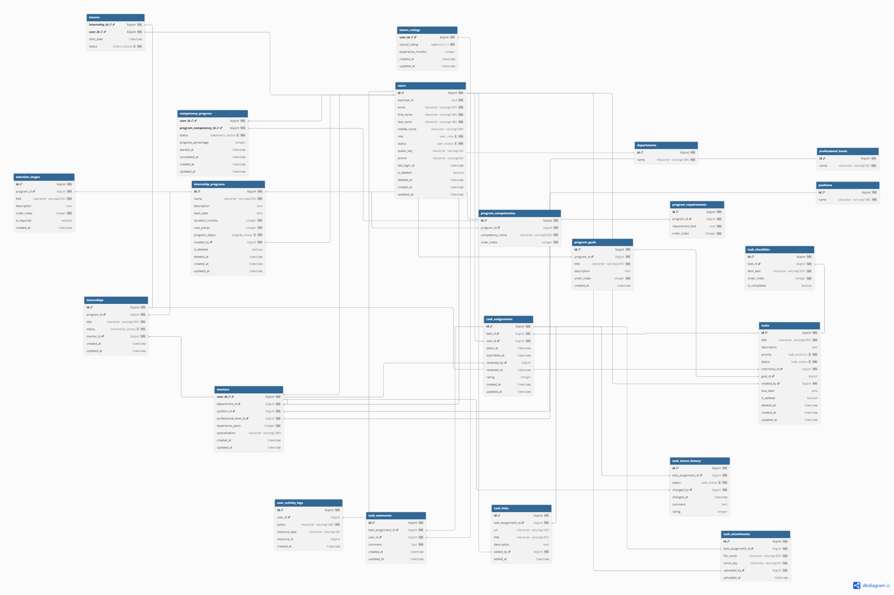


**Физическая схема БД notification**

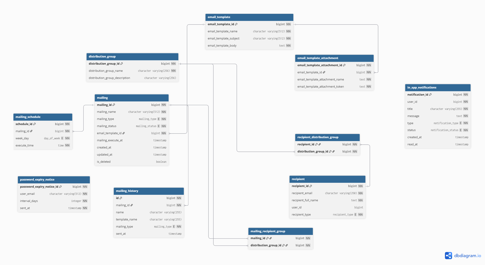

---

## **Функциональные возможности**

### Диаграмма вариантов использования

Диаграмма вариантов использования и ее описание

### User-flow диаграммы

**User-flow диаграмма стажера**


**User-flow диаграмма ментора**


**User-flow диаграмма HR-менеджера**


**User-flow диаграмма администратора**


---

## **Пользовательский интерфейс**

### Примеры экранов UI

Ссылка на репозиторий клиента: https://github.com/pashpashovich/GrowPathClient

#### Форма авторизации:

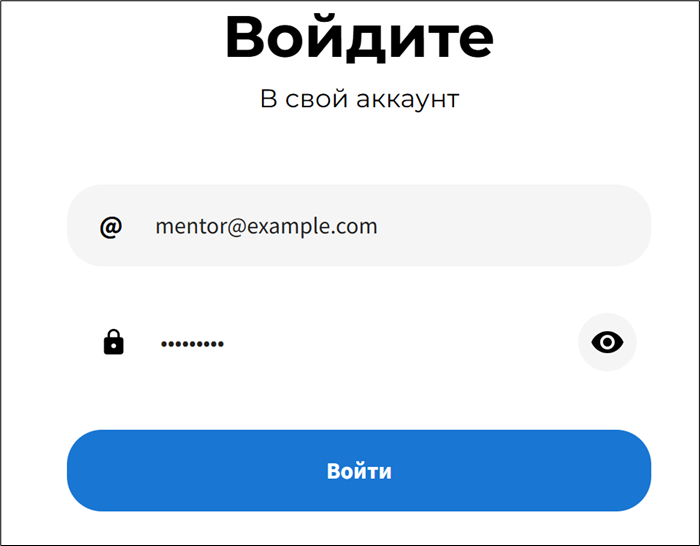

#### Канбан-доска задач ментора:

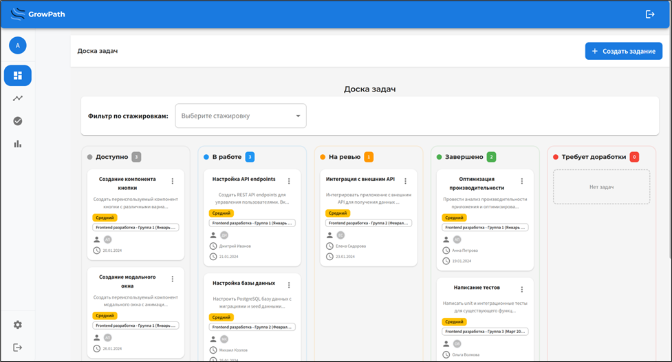

#### Экран с деталями задачи:

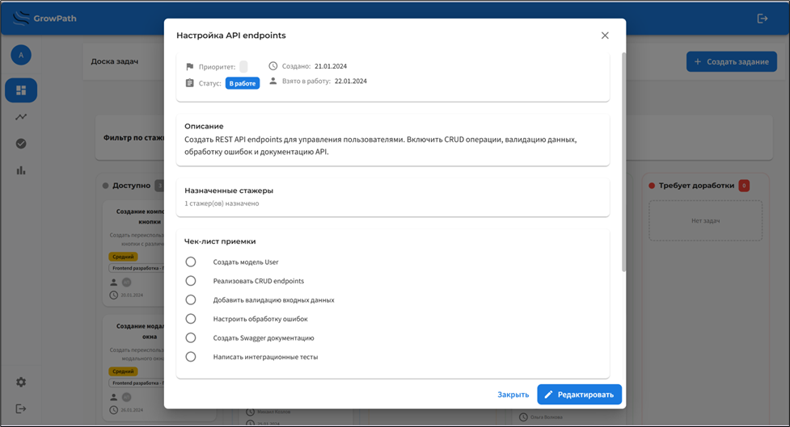

#### Экран создания задачи:

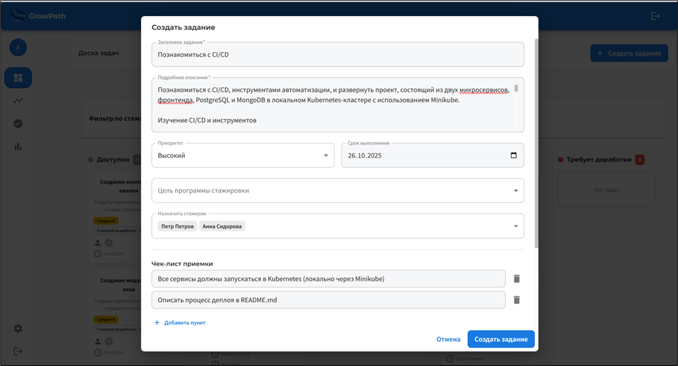

#### Экран дорожной карты стажеров:

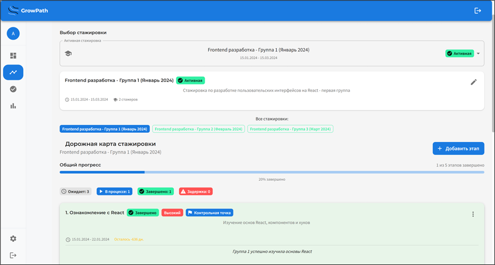

#### Экран проверки заданий:

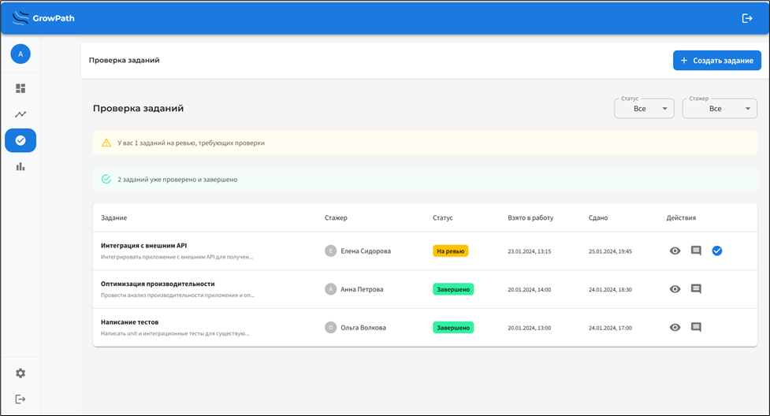

#### Экран управления программами стажировки:

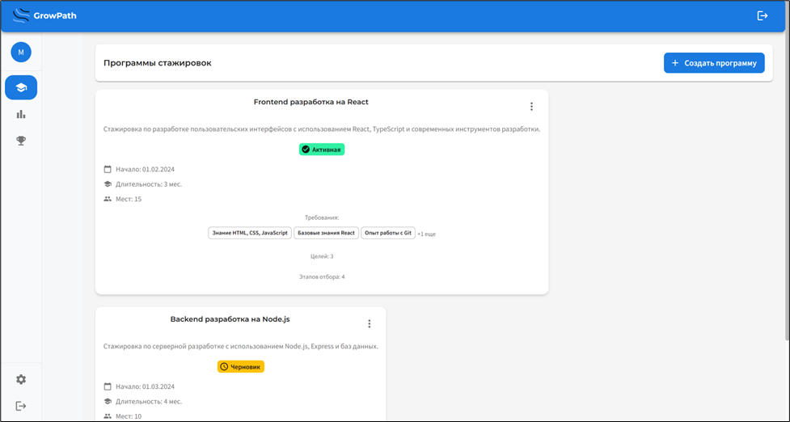

#### Экран создания программы стажировки:

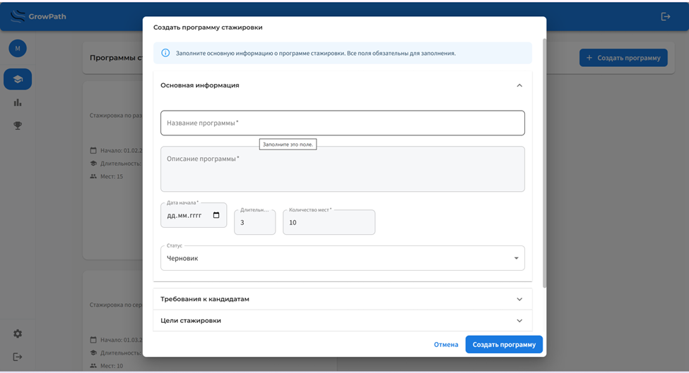

#### Экран с деталями программы стажировки:

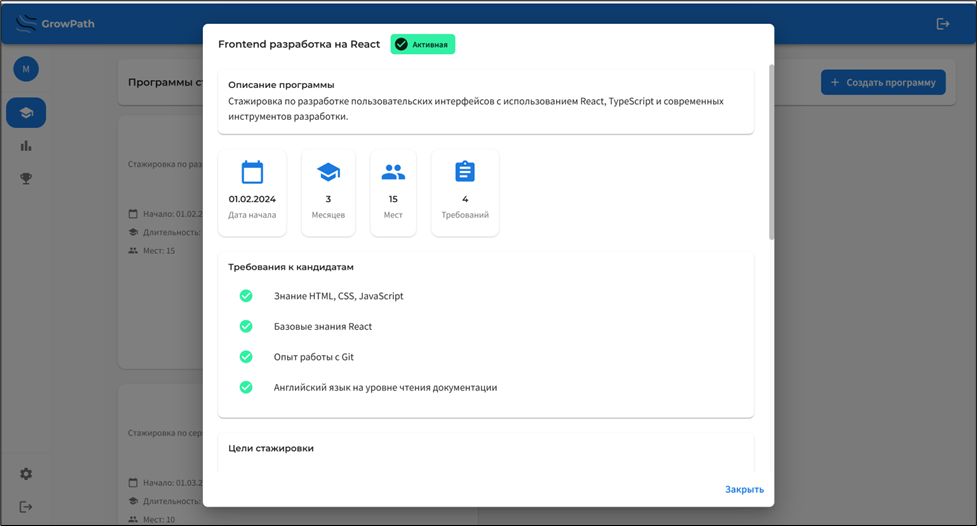

#### Экран аналитики программ стажировок:

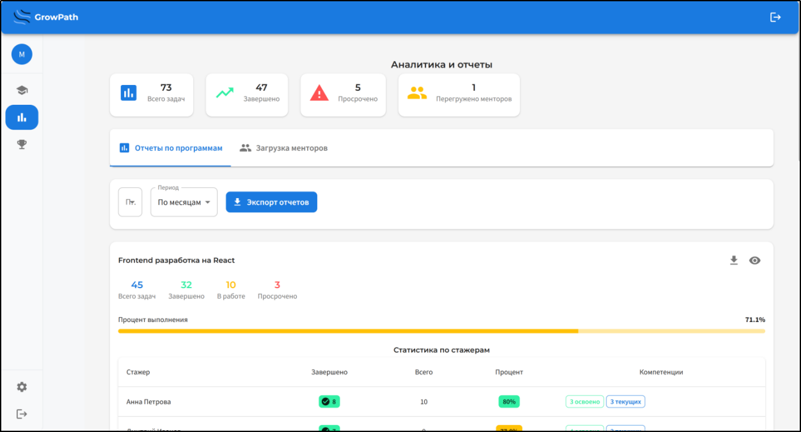

#### Экран загрузки менторов:

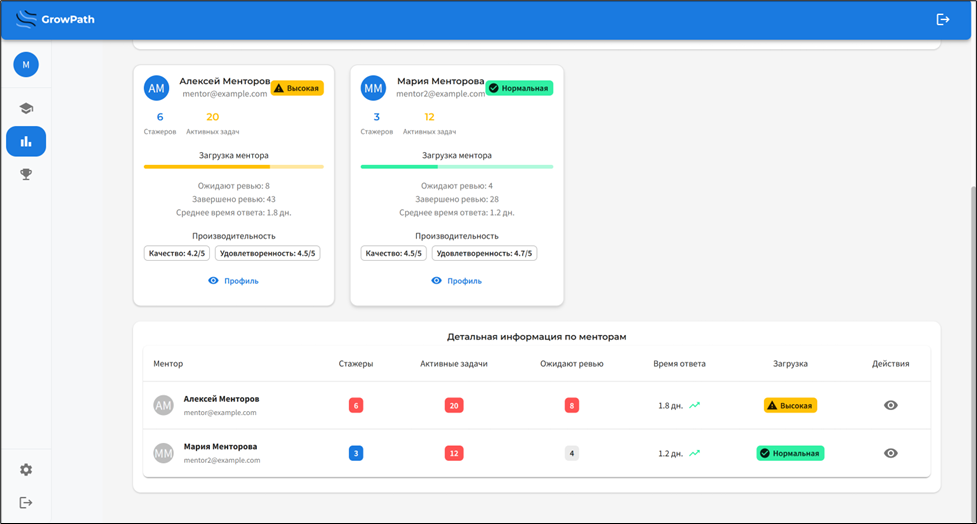

#### Экран задач стажера:

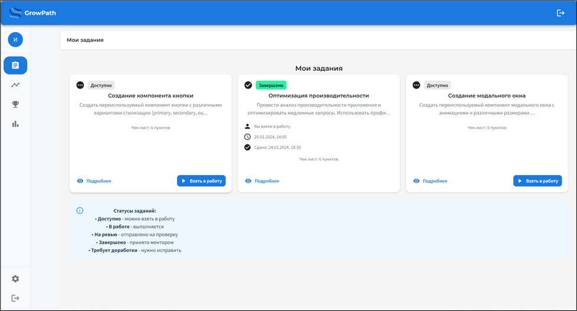

#### Экран с деталями задачи (в модуле стажера):

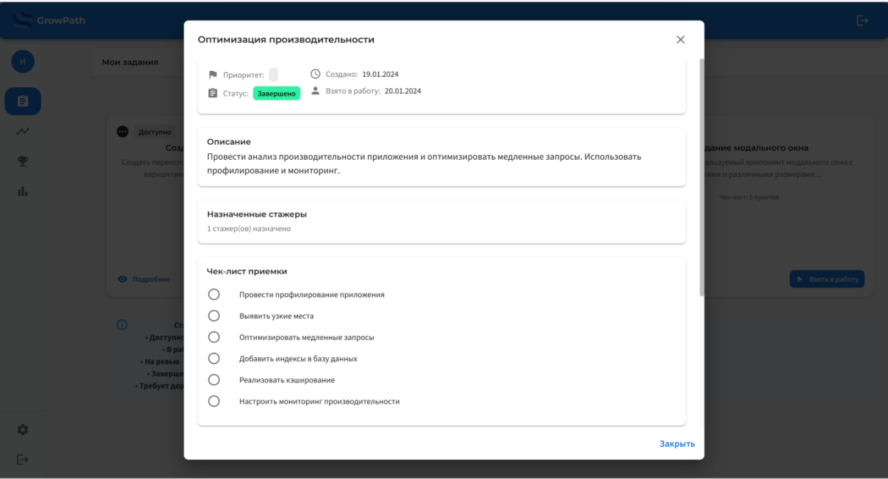

#### Экран прогресса стажера:

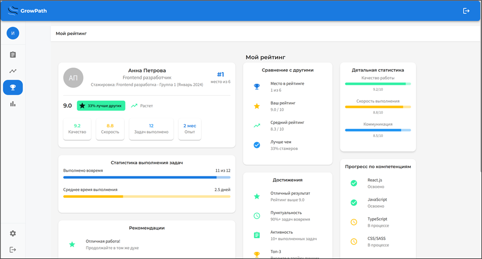

#### Экран управления пользователями:

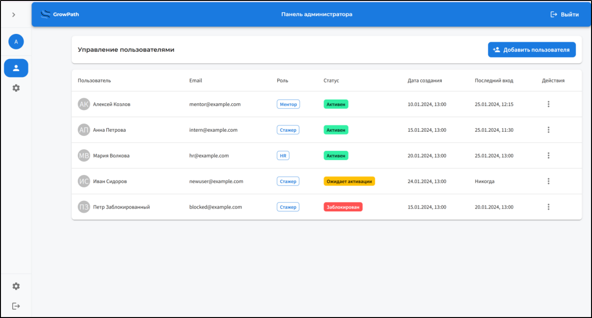

#### Экран добавления пользователя:

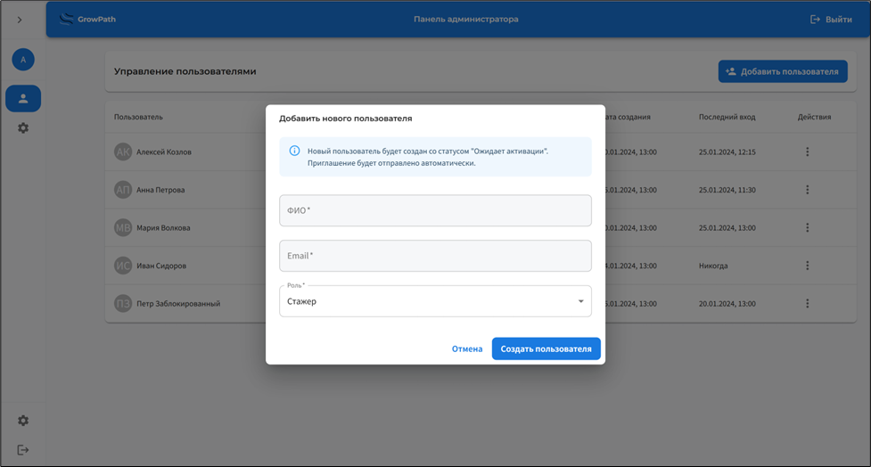


---

## **Детали реализации**

### UML-диаграммы

Представить все UML-диаграммы , которые позволят более точно понять структуру и детали реализации ПС

### Спецификация API

Представить описание реализованных функциональных возможностей ПС с использованием Open API (можно представить либо полный файл спецификации, либо ссылку на него)

### Безопасность

#### Система аутентификации и авторизации

##### Обзор

В системе реализована комплексная система аутентификации и авторизации на основе OAuth2/OpenID Connect с использованием Keycloak в качестве Identity Provider. Все запросы проходят через API Gateway, который обеспечивает централизованную аутентификацию и авторизацию.

##### Используемые компоненты

###### 1. Keycloak
**Keycloak** - это open-source решение для управления идентификацией и доступом (IAM), которое обеспечивает:
- Централизованную аутентификацию пользователей
- Управление ролями и правами доступа
- Поддержку протоколов OAuth2 и OpenID Connect
- Выдачу JWT токенов

###### 2. Spring Security OAuth2 Resource Server
Используется для валидации JWT токенов на стороне микросервисов. Автоматически проверяет подпись токенов через JWK Set endpoint Keycloak.

###### 3. Spring Cloud Gateway
Обеспечивает маршрутизацию запросов и обработку аутентификации через кастомные фильтры.

##### Архитектура системы безопасности

```
┌─────────────┐
│   Client    │
│ (Frontend)  │
└──────┬──────┘
       │
       │ HTTP Request
       ▼
┌─────────────────────────────────┐
│       API Gateway               │
│  ┌──────────────────────────┐  │
│  │  CORS Filter             │  │
│  └──────────────────────────┘  │
│  ┌──────────────────────────┐  │
│  │  Security Filter Chain   │  │
│  │  - JWT Validation        │  │
│  │  - Authorization          │  │
│  └──────────────────────────┘  │
│  ┌──────────────────────────┐  │
│  │  Auth Filters            │  │
│  │  - Login                 │  │
│  │  - Logout                │  │
│  │  - Refresh Token         │  │
│  └──────────────────────────┘  │
└──────┬──────────────────────────┘
       │
       ├─────────────────┐
       │                 │
       ▼                 ▼
┌─────────────┐   ┌──────────────┐
│  Keycloak   │   │  Microservices│
│  (IAM)      │   │  - Trainee   │
│             │   │  - Notification│
└─────────────┘   └──────────────┘
```

##### Реализация аутентификации

###### 1. Конфигурация Spring Security

```java
@Configuration
@EnableWebFluxSecurity
public class SecurityConfig {

    @Bean
    public SecurityWebFilterChain securityWebFilterChain(ServerHttpSecurity http) {
        http
                .csrf(ServerHttpSecurity.CsrfSpec::disable)
                .authorizeExchange(exchanges -> exchanges
                        .pathMatchers("/actuator/**", "/health").permitAll()
                        .pathMatchers("/api/auth/login", "/api/auth/logout", "/api/auth/refresh").permitAll()
                        .pathMatchers("/api/auth/user", "/api/auth/validate").authenticated()
                        .anyExchange().authenticated()
                )
                .oauth2ResourceServer(oauth2 -> oauth2.jwt(jwt -> {
                }));

        return http.build();
    }
}
```

###### 2. Сервис аутентификации

```java
@Service
public class AuthService {

    private final WebClient webClient;
    private final String keycloakUrl;
    private final String realm;
    private final String clientId;
    private final String clientSecret;

    public AuthService(
            WebClient.Builder webClientBuilder,
            @Value("${spring.security.oauth2.resourceserver.jwt.issuer-uri}") String issuerUri,
            @Value("${keycloak.client.id:api-gateway}") String clientId,
            @Value("${keycloak.client.secret:api-gateway-secret}") String clientSecret) {
        this.webClient = webClientBuilder.build();

        if (issuerUri.contains("/realms/")) {
            int realmsIndex = issuerUri.indexOf("/realms/");
            this.keycloakUrl = issuerUri.substring(0, realmsIndex);
            this.realm = issuerUri.substring(realmsIndex + "/realms/".length());
        } else {
            this.keycloakUrl = "http://localhost:8090";
            this.realm = "growpath";
        }
        this.clientId = clientId;
        this.clientSecret = clientSecret;
    }

    public Mono<TokenResponse> login(String username, String password) {
        String tokenUrl = String.format("%s/realms/%s/protocol/openid-connect/token", 
                keycloakUrl, realm);

        MultiValueMap<String, String> formData = new LinkedMultiValueMap<>();
        formData.add("grant_type", "password");
        formData.add("client_id", clientId);
        formData.add("client_secret", clientSecret);
        formData.add("username", username);
        formData.add("password", password);

        return webClient.post()
                .uri(tokenUrl)
                .contentType(MediaType.APPLICATION_FORM_URLENCODED)
                .body(BodyInserters.fromFormData(formData))
                .retrieve()
                .bodyToMono(TokenResponse.class)
                .onErrorMap(ex -> new RuntimeException("Failed to authenticate user", ex));
    }

    public Mono<TokenResponse> refreshToken(String refreshToken) {
        String tokenUrl = String.format("%s/realms/%s/protocol/openid-connect/token", 
                keycloakUrl, realm);

        MultiValueMap<String, String> formData = new LinkedMultiValueMap<>();
        formData.add("grant_type", "refresh_token");
        formData.add("client_id", clientId);
        formData.add("client_secret", clientSecret);
        formData.add("refresh_token", refreshToken);

        return webClient.post()
                .uri(tokenUrl)
                .contentType(MediaType.APPLICATION_FORM_URLENCODED)
                .body(BodyInserters.fromFormData(formData))
                .retrieve()
                .bodyToMono(TokenResponse.class)
                .onErrorMap(ex -> new RuntimeException("Failed to refresh token", ex));
    }

    public Mono<Void> logout(String refreshToken) {
        String logoutUrl = String.format("%s/realms/%s/protocol/openid-connect/logout", 
                keycloakUrl, realm);

        MultiValueMap<String, String> formData = new LinkedMultiValueMap<>();
        formData.add("client_id", clientId);
        formData.add("client_secret", clientSecret);
        formData.add("refresh_token", refreshToken);

        return webClient.post()
                .uri(logoutUrl)
                .contentType(MediaType.APPLICATION_FORM_URLENCODED)
                .body(BodyInserters.fromFormData(formData))
                .retrieve()
                .bodyToMono(Void.class)
                .onErrorMap(ex -> new RuntimeException("Failed to logout", ex));
    }

    public String getAuthorizationUrl(String redirectUri) {
        return String.format("%s/realms/%s/protocol/openid-connect/auth?client_id=%s&redirect_uri=%s&response_type=code&scope=openid profile email roles",
                keycloakUrl, realm, clientId, redirectUri);
    }
}
```

###### 3. Gateway Filter для аутентификации

```java
@Slf4j
@Component
public class KeycloakAuthenticationFilter extends AbstractGatewayFilterFactory<KeycloakAuthenticationFilter.Config> {

    private final AuthService authService;
    private final ObjectMapper objectMapper;

    public KeycloakAuthenticationFilter(AuthService authService, ObjectMapper objectMapper) {
        super(Config.class);
        this.authService = authService;
        this.objectMapper = objectMapper;
    }

    @Override
    public String name() {
        return "KeycloakAuthentication";
    }

    @Override
    public GatewayFilter apply(Config config) {
        return (exchange, chain) -> {
            ServerHttpRequest request = exchange.getRequest();

            return DataBufferUtils.join(request.getBody())
                    .flatMap(dataBuffer -> {
                        byte[] bytes = new byte[dataBuffer.readableByteCount()];
                        dataBuffer.read(bytes);
                        DataBufferUtils.release(dataBuffer);

                        String body = new String(bytes, StandardCharsets.UTF_8);

                        try {
                            @SuppressWarnings("unchecked")
                            Map<String, String> loginRequest = objectMapper.readValue(body, Map.class);
                            String username = loginRequest.get("username");
                            String password = loginRequest.get("password");

                            if (!StringUtils.hasText(username) || !StringUtils.hasText(password)) {
                                return handleError(exchange, HttpStatus.BAD_REQUEST,
                                                   "Username and password are required");
                            }

                            return authService.login(username, password)
                                    .flatMap(tokenResponse -> {
                                        ServerHttpResponse response = exchange.getResponse();
                                        response.setStatusCode(HttpStatus.OK);
                                        response.getHeaders().setContentType(MediaType.APPLICATION_JSON);

                                        try {
                                            String json = objectMapper.writeValueAsString(tokenResponse);
                                            DataBuffer buffer = response.bufferFactory()
                                                    .wrap(json.getBytes(StandardCharsets.UTF_8));
                                            return response.writeWith(Mono.just(buffer));
                                        }
                                        catch (JsonProcessingException e) {
                                            return handleError(exchange, HttpStatus.INTERNAL_SERVER_ERROR,
                                                               "Error serializing response");
                                        }
                                    })
                                    .onErrorResume(ex -> {
                                        log.error("Authentication failed", ex);
                                        return handleError(exchange, HttpStatus.UNAUTHORIZED,
                                                           "Authentication failed: " + ex.getMessage());
                                    });
                        }
                        catch (JsonProcessingException e) {
                            log.error("Error parsing login request", e);
                            return handleError(exchange, HttpStatus.BAD_REQUEST, "Invalid request body");
                        }
                    })
                    .switchIfEmpty(handleError(exchange, HttpStatus.BAD_REQUEST, "Request body is required"));
        };
    }

    private Mono<Void> handleError(ServerWebExchange exchange, HttpStatus status, String message) {
        ServerHttpResponse response = exchange.getResponse();
        response.setStatusCode(status);
        response.getHeaders().setContentType(MediaType.APPLICATION_JSON);

        try {
            Map<String, String> errorResponse = Map.of(
                    "error", status.getReasonPhrase(),
                    "message", message
            );
            String json = objectMapper.writeValueAsString(errorResponse);
            DataBuffer buffer = response.bufferFactory().wrap(json.getBytes(StandardCharsets.UTF_8));
            return response.writeWith(Mono.just(buffer));
        }
        catch (JsonProcessingException e) {
            DataBuffer buffer = response.bufferFactory().wrap(message.getBytes(StandardCharsets.UTF_8));
            return response.writeWith(Mono.just(buffer));
        }
    }

    public static class Config {
    }
}
```

##### Реализация авторизации

###### 1. Извлечение ролей из JWT

```java
@NoArgsConstructor(access = AccessLevel.PRIVATE)
public class JwtUtils {

    public static Collection<GrantedAuthority> extractRoles(Jwt jwt) {
        @SuppressWarnings("unchecked")
        var realmAccess = (java.util.Map<String, Object>) jwt.getClaims().get("realm_access");
        if (realmAccess == null) {
            return List.of();
        }

        @SuppressWarnings("unchecked")
        var roles = (List<String>) realmAccess.get("roles");
        if (roles == null) {
            return List.of();
        }

        return roles.stream()
                .map(role -> new SimpleGrantedAuthority("ROLE_" + role))
                .collect(Collectors.toList());
    }

    public static boolean hasRole(Jwt jwt, String role) {
        return extractRoles(jwt).stream()
                .anyMatch(authority -> authority.getAuthority().equals("ROLE_" + role));
    }

    public static String getUsername(Jwt jwt) {
        Object claim = jwt.getClaims().get("preferred_username");
        return claim instanceof String ? (String) claim : null;
    }

    public static String getEmail(Jwt jwt) {
        Object claim = jwt.getClaims().get("email");
        return claim instanceof String ? (String) claim : null;
    }

    public static String getFirstName(Jwt jwt) {
        Object claim = jwt.getClaims().get("given_name");
        return claim instanceof String ? (String) claim : null;
    }

    public static String getLastName(Jwt jwt) {
        Object claim = jwt.getClaims().get("family_name");
        return claim instanceof String ? (String) claim : null;
    }
}
```

###### 2. Получение информации о пользователе

```java
@Component
public class KeycloakUserInfoFilter extends AbstractGatewayFilterFactory<KeycloakUserInfoFilter.Config> {

    @Override
    public GatewayFilter apply(Config config) {
        return (exchange, chain) -> {
            return exchange.getPrincipal()
                    .cast(JwtAuthenticationToken.class)
                    .map(JwtAuthenticationToken::getToken)
                    .flatMap(jwt -> {
                        Map<String, Object> userInfo = new HashMap<>();
                        userInfo.put("username", JwtUtils.getUsername(jwt));
                        userInfo.put("email", JwtUtils.getEmail(jwt));
                        userInfo.put("roles", JwtUtils.extractRoles(jwt).stream()
                                .map(GrantedAuthority::getAuthority)
                                .toList());
                        return response.writeWith(Mono.just(buffer));
                    });
        };
    }
}
```

##### Механизмы обеспечения безопасности

###### 1. CORS (Cross-Origin Resource Sharing)

Настроен для безопасного взаимодействия с фронтенд-приложением:

```java
@Configuration
public class CorsConfig {

    @Value("${cors.allowed-origins:http://localhost:3000,http://localhost:5173}")
    private String allowedOrigins;

    @Value("${cors.allowed-methods:GET,POST,PUT,DELETE,OPTIONS}")
    private String allowedMethods;

    @Value("${cors.allowed-headers:Content-Type,Authorization}")
    private String allowedHeaders;

    @Value("${cors.allow-credentials:true}")
    private boolean allowCredentials;

    @Bean
    public CorsWebFilter corsWebFilter() {
        CorsConfiguration corsConfiguration = new CorsConfiguration();
        
        List<String> origins = Arrays.asList(allowedOrigins.split(","));
        corsConfiguration.setAllowedOrigins(origins);
        
        List<String> methods = Arrays.asList(allowedMethods.split(","));
        corsConfiguration.setAllowedMethods(methods);
        
        List<String> headers = Arrays.asList(allowedHeaders.split(","));
        corsConfiguration.setAllowedHeaders(headers);
        
        corsConfiguration.setAllowCredentials(allowCredentials);
        
        corsConfiguration.setExposedHeaders(Arrays.asList("Authorization", "Content-Type"));
        
        corsConfiguration.setMaxAge(3600L);

        UrlBasedCorsConfigurationSource source = new UrlBasedCorsConfigurationSource();
        source.registerCorsConfiguration("/**", corsConfiguration);

        return new CorsWebFilter(source);
    }
}
```

###### 2. JWT (JSON Web Tokens)

- **Access Token**: используется для доступа к защищенным ресурсам, имеет ограниченное время жизни
- **Refresh Token**: используется для обновления access token без повторной аутентификации
- Валидация токенов происходит автоматически через Spring Security OAuth2 Resource Server

###### 3. Система разграничения прав доступа

Роли пользователей хранятся в Keycloak и передаются в JWT токене:
- Роли извлекаются из токена через `JwtUtils.extractRoles()`
- Преобразуются в `GrantedAuthority` для использования в Spring Security
- Проверка прав доступа осуществляется на уровне Gateway и микросервисов

###### 4. Защита от CSRF

CSRF защита отключена в API Gateway, так как используется stateless аутентификация через JWT токены.

###### 5. Шифрование паролей

Keycloak использует современные алгоритмы хеширования паролей (bcrypt, pbkdf2) по умолчанию. Пароли не хранятся в открытом виде.

###### 6. Безопасность передаваемых данных

- Все запросы к защищенным эндпоинтам требуют наличия валидного JWT токена в заголовке `Authorization: Bearer <token>`
- Токены подписываются с использованием RSA/ECDSA ключей
- Валидация подписи происходит через JWK Set endpoint Keycloak

##### Маршрутизация аутентификации

Аутентификация реализована через Spring Cloud Gateway фильтры:

```yaml
spring:
  cloud:
    gateway:
      routes:
        - id: login
          uri: no://op
          predicates:
            - Path=/api/auth/login
            - Method=POST
          filters:
            - KeycloakAuthentication
        - id: logout
          uri: no://op
          predicates:
            - Path=/api/auth/logout
            - Method=POST
          filters:
            - KeycloakLogout
        - id: refresh
          uri: no://op
          predicates:
            - Path=/api/auth/refresh
            - Method=POST
          filters:
            - KeycloakRefresh
```

##### Эндпоинты аутентификации

| Эндпоинт | Метод | Описание | Требует аутентификации |
|----------|-------|----------|------------------------|
| `/api/auth/login` | POST | Аутентификация пользователя | Нет |
| `/api/auth/logout` | POST | Выход из системы | Нет |
| `/api/auth/refresh` | POST | Обновление access token | Нет |
| `/api/auth/user` | GET | Получение информации о текущем пользователе | Да |
| `/api/auth/validate` | GET | Валидация токена | Да |

##### Конфигурация

###### Переменные окружения

```yaml
KEYCLOAK_URL: http://localhost:8090
KEYCLOAK_REALM: growpath
KEYCLOAK_CLIENT_ID: api-gateway
KEYCLOAK_CLIENT_SECRET: api-gateway-secret

CORS_ALLOWED_ORIGINS: http://localhost:3000,http://localhost:5173
CORS_ALLOWED_METHODS: GET,POST,PUT,DELETE,OPTIONS
CORS_ALLOWED_HEADERS: Content-Type,Authorization
CORS_ALLOW_CREDENTIALS: true
```

##### Безопасность микросервисов

Каждый микросервис настроен для валидации JWT токенов:

```yaml
spring:
  security:
    oauth2:
      resourceserver:
        jwt:
          issuer-uri: ${KEYCLOAK_URL}/realms/${KEYCLOAK_REALM}
          jwk-set-uri: ${KEYCLOAK_URL}/realms/${KEYCLOAK_REALM}/protocol/openid-connect/certs
```

Микросервисы автоматически:
- Валидируют подпись JWT токена
- Проверяют срок действия токена
- Извлекают роли пользователя из токена


### Оценка качества кода

Используя показатели качества и метрики кода, оценить его качество

---

## **Тестирование**

### Unit-тесты

Представить код тестов для пяти методов и его пояснение

### Интеграционные тесты

Представить код тестов и его пояснение

---

## **Установка и  запуск**

### Манифесты для сборки docker образов

Представить весь код манифестов или ссылки на файлы с ними (при необходимости снабдить комментариями)

### Манифесты для развертывания k8s кластера

Представить весь код манифестов или ссылки на файлы с ними (при необходимости снабдить комментариями)

---

## **Лицензия**

Этот проект лицензирован по лицензии MIT - подробности представлены в файле [[License.md|LICENSE.md]]

---

## **Контакты**

Косович Павел: pavel.kosovich2004@gmail.com
